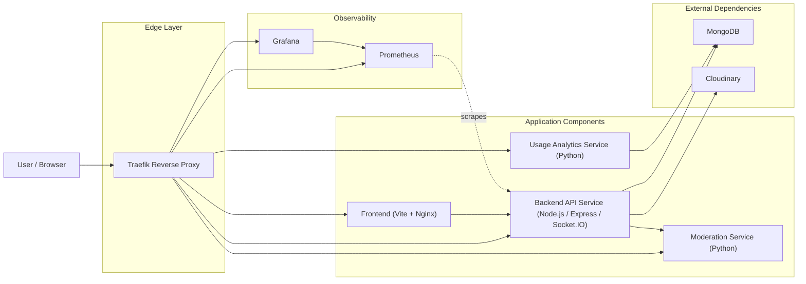

# Component Diagram

This UML-style component diagram shows the main microservices in the project and their dependencies.

## Notes

- `Traefik` is the entry point for incoming HTTP traffic and routes requests to the correct service.
- `Backend API Service` is the main application service and depends on `MongoDB`, `Cloudinary`, and the `Moderation Service`.
- `Usage Analytics Service` is a separate microservice that reads analytics-related data from `MongoDB`.
- `Prometheus` collects metrics from the backend, and `Grafana` visualizes those metrics.
