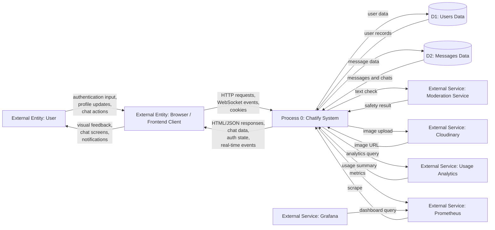

# Data Flow Diagram

This document contains two Data Flow Diagrams (DFDs):

- `Level 0` for the overall system context
- `Level 1` for internal request handling and processing

## 1) DFD Level 0: System Context

## 2) DFD Level 1: Internal Request Handling and Processing

```mermaid
flowchart LR
    user["External Entity: User"]

    auth["1. Authentication Processing"]
    message["2. Message Processing"]
    moderationProc["3. Content Moderation"]
    analytics["4. Analytics Processing"]

    usersDb[("D1: Users")]
    messagesDb[("D2: Messages")]

    moderationSvc["External: Moderation Service"]
    cloudinary["External: Cloudinary"]

    user -->|"signup / login / logout /\nauth check requests"| auth
    auth -->|"auth response / cookie / user info"| user
    auth -->|"create / read / update user"| usersDb
    usersDb -->|"user record"| auth

    user -->|"send message / get contacts /\nget chats / get messages"| message
    message -->|"chat data / message response"| user
    message -->|"read users"| usersDb
    usersDb -->|"contact list / receiver data"| message
    message -->|"create / read messages"| messagesDb
    messagesDb -->|"message history / chat records"| message

    message -->|"message text"| moderationProc
    moderationProc -->|"moderation request"| moderationSvc
    moderationSvc -->|"flagged / safe result"| moderationProc
    moderationProc -->|"filtered text"| message

    message -->|"image payload"| cloudinary
    cloudinary -->|"hosted image URL"| message

    analytics -->|"read message statistics"| messagesDb
    messagesDb -->|"message timestamps / types"| analytics
```

## Notes

- `Level 0` is still a context diagram, but it now shows the most important external interactions in more concrete terms.
- `Authentication Processing` handles signup, login, logout, profile validation, and token-based identity checks.
- `Message Processing` handles contacts, chat history, sending messages, and real-time chat-related operations.
- `Content Moderation` is shown as a separate process because message text may be checked before storage.
- `Analytics Processing` reads message data from the messages store for reporting and summary generation.
