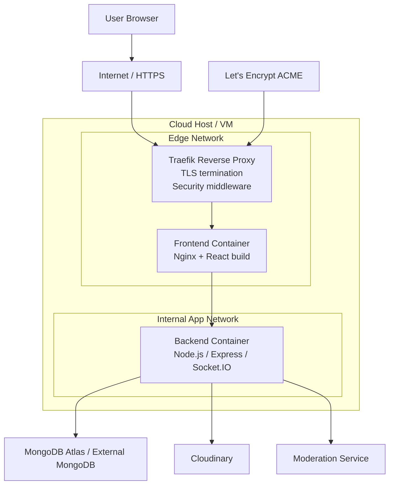
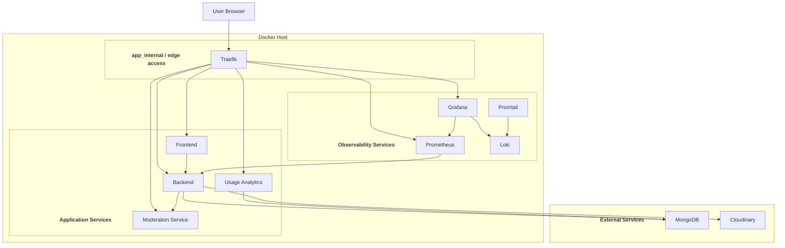

# Deployment Diagram

This diagram illustrates the deployment setup used by the project, based on the Docker Compose configuration.

The main cloud-style deployment is described by:

- [docker-compose.secure.yml](../docker-compose.secure.yml)
- [infra/traefik/traefik.yml](../infra/traefik/traefik.yml)
- [infra/traefik/dynamic/security.yml](../infra/traefik/dynamic/security.yml)

The larger local/dev stack in [docker-compose.yml](../docker-compose.yml) extends this with monitoring and logging services such as Prometheus, Grafana, Loki, and Promtail.

## 1) Cloud Deployment Diagram

## 2) Extended Local / Coursework Deployment Diagram

## Notes

- In the secure deployment, `Traefik` is the public entry point and handles HTTPS termination with Let's Encrypt.
- The `frontend` container is the public web application exposed through Traefik.
- The `backend` container is not directly exposed to the internet; it is reached through the reverse proxy and internal network path.
- The backend depends on external services such as `MongoDB` and `Cloudinary`.
- The local/coursework deployment also includes `usage-analytics`, `prometheus`, `grafana`, `loki`, and `promtail`.
- The secure deployment uses separate Docker networks:
  - `edge` for publicly routed services
  - `app_internal` for internal service communication
