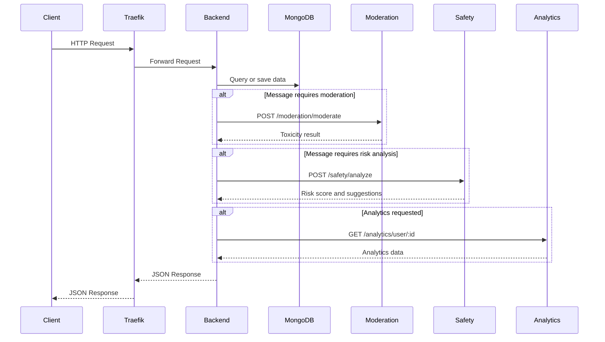
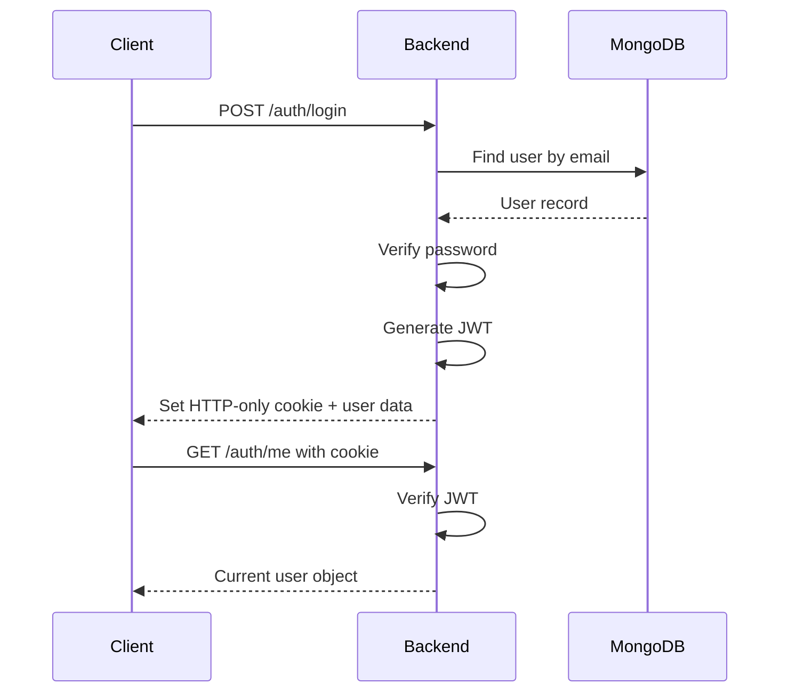
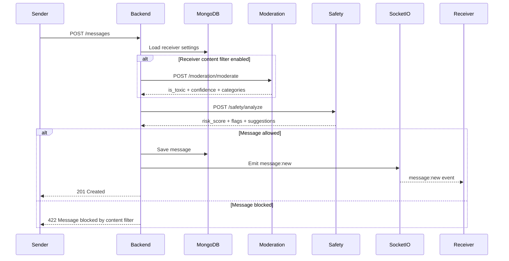
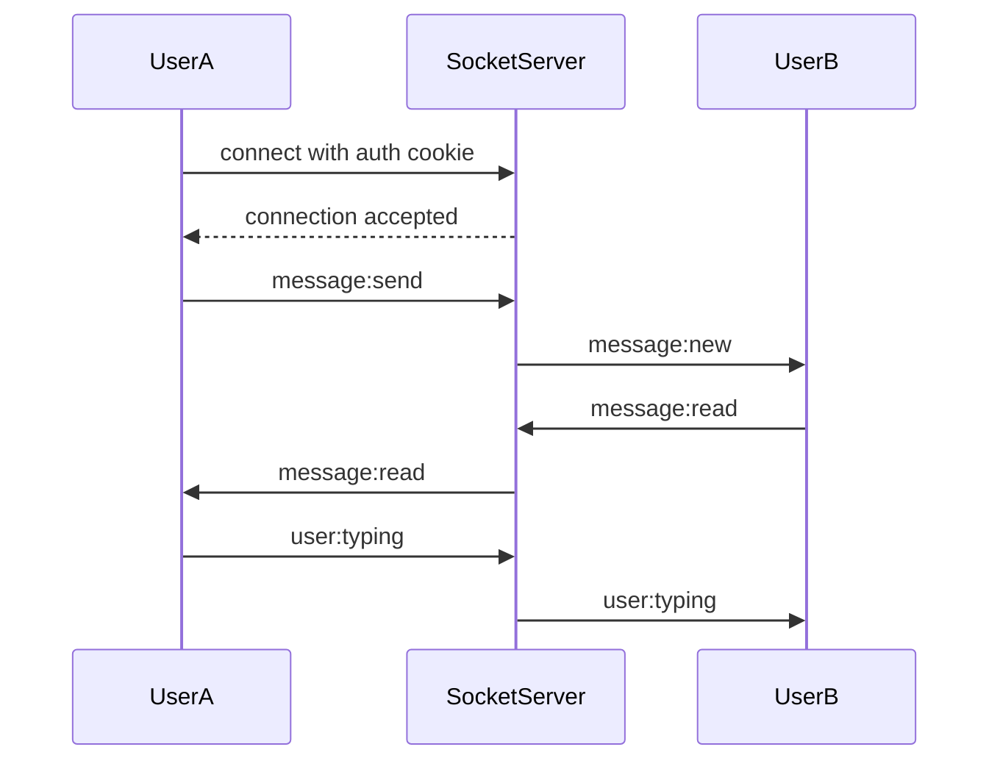

# Chatify API Documentation

**Version:** 1.0.0  
**Format:** Markdown + OpenAPI 3.0  
**Application:** Chatify Real-Time Chat Application  
**Architecture:** Node.js/Express backend, Socket.IO real-time messaging, MongoDB Atlas database, and Python FastAPI microservices for moderation, chat safety, and analytics.

---

## Table of Contents

1. [API Overview](#1-api-overview)
2. [Base URLs](#2-base-urls)
3. [Authentication](#3-authentication)
4. [Rate Limiting](#4-rate-limiting)
5. [Standard Response Format](#5-standard-response-format)
6. [Mermaid API Flow Diagrams](#6-mermaid-api-flow-diagrams)
7. [REST API Endpoints](#7-rest-api-endpoints)
8. [WebSocket / Socket.IO Documentation](#8-websocket--socketio-documentation)
9. [Schemas and Data Models](#9-schemas-and-data-models)
10. [Error Codes](#10-error-codes)
11. [OpenAPI 3.0 Specification](#11-openapi-30-specification)
12. [Developer Notes](#12-developer-notes)

---

# 1. API Overview

Chatify is a real-time chat application that allows users to register, log in, search for other users, send messages, receive real-time events, and manage content safety settings.

The system uses a microservices architecture:

- **Main Backend:** Node.js + Express
- **Real-Time Layer:** Socket.IO
- **Authentication:** JWT stored in HTTP-only cookies
- **Database:** MongoDB Atlas
- **Reverse Proxy / Gateway:** Traefik or equivalent gateway
- **Microservices:** Python FastAPI services for moderation, chat safety, and analytics
- **Monitoring:** Prometheus metrics endpoint

The API supports both standard REST communication and real-time WebSocket communication.

---

# 2. Base URLs

| Environment | Base URL |
|---|---|
| Development | `http://localhost/api` |
| Production | `https://chatify-app.com/api` |

Example request:

```bash
curl -X GET http://localhost/api/health
```

---

# 3. Authentication

Chatify uses JWT authentication. After a successful login, the backend sets a JWT token in an HTTP-only cookie. The client does not need to manually store the token in local storage.

## 3.1 Authentication Method

| Item | Value |
|---|---|
| Token Type | JWT |
| Storage | HTTP-only cookie |
| Cookie Name | `jwt` |
| Protected Endpoint Requirement | Valid authenticated cookie |
| Public Endpoints | Signup, login, health check, metrics depending on deployment policy |

## 3.2 Cookie Settings

Recommended cookie settings:

| Setting | Development | Production |
|---|---|---|
| `httpOnly` | `true` | `true` |
| `secure` | `false` if using HTTP locally | `true` |
| `sameSite` | `lax` | `none` or `lax`, depending on frontend/backend domains |
| `maxAge` | Application-defined | Application-defined |

Example cookie behavior after login:

```http
Set-Cookie: jwt=<token>; HttpOnly; Path=/; SameSite=Lax; Max-Age=604800
```

In production over HTTPS:

```http
Set-Cookie: jwt=<token>; HttpOnly; Secure; Path=/; SameSite=None; Max-Age=604800
```

## 3.3 Protected and Public Endpoints

| Endpoint | Public / Protected |
|---|---|
| `POST /auth/signup` | Public |
| `POST /auth/login` | Public |
| `POST /auth/logout` | Protected or public depending on implementation |
| `GET /auth/me` | Protected |
| `GET /messages` | Protected |
| `POST /messages` | Protected |
| `GET /messages/contacts` | Protected |
| `GET /messages/chats` | Protected |
| `GET /users` | Protected |
| `PATCH /users/settings` | Protected |
| `POST /moderation/moderate` | Internal service or protected |
| `POST /safety/analyze` | Internal service or protected |
| `GET /analytics/user/:id` | Protected or admin-only |
| `GET /health` | Public |
| `GET /metrics` | Protected, internal, or monitoring-only |

---

# 4. Rate Limiting

Recommended rate limits:

| Endpoint Group | Suggested Limit | Reason |
|---|---:|---|
| Authentication | 5 requests/minute/IP | Prevent brute-force login attempts |
| Message sending | 60 requests/minute/user | Prevent spam |
| User search | 30 requests/minute/user | Prevent scraping |
| Microservices | Internal only | Prevent direct abuse |
| Health check | 120 requests/minute/IP | Allow monitoring |
| Metrics | Internal network only | Avoid exposing system data |

Example rate limit response:

```json
{
  "success": false,
  "error": {
    "code": "RATE_LIMIT_EXCEEDED",
    "message": "Too many requests. Please try again later.",
    "details": {
      "retryAfter": 60
    }
  }
}
```

---

# 5. Standard Response Format

## 5.1 Success Response

```json
{
  "success": true,
  "data": {}
}
```

## 5.2 Error Response

```json
{
  "success": false,
  "error": {
    "code": "VALIDATION_ERROR",
    "message": "Invalid request data.",
    "details": {}
  }
}
```

## 5.3 Pagination Response

```json
{
  "success": true,
  "data": [],
  "pagination": {
    "page": 1,
    "limit": 20,
    "total": 150,
    "totalPages": 8,
    "hasNextPage": true,
    "hasPreviousPage": false
  }
}
```

---

# 6. Mermaid API Flow Diagrams

## 6.1 General API Request Flow



## 6.2 JWT Authentication Flow



## 6.3 Message Sending and Moderation Flow



## 6.4 WebSocket Event Flow



---

# 7. REST API Endpoints

---

## 7.1 Authentication Endpoints

---

## 7.1.1 Register New User

**Method:** `POST`  
**URL:** `/auth/signup`  
**Auth Required:** No  
**Content-Type:** `application/json`

### Description

Creates a new user account with an email, password, and display name.

### Parameters

No path or query parameters are required.

### Request Body

| Field | Type | Required | Description |
|---|---|---:|---|
| `email` | string | Yes | User email address |
| `password` | string | Yes | User password |
| `name` | string | Yes | User display name |

### Example Request

```json
{
  "email": "alex@example.com",
  "password": "StrongPassword123!",
  "name": "Alex Carter"
}
```

### Success Response: `201 Created`

```json
{
  "success": true,
  "data": {
    "user": {
      "id": "665f1d2c0a70c3a8e7f6a111",
      "email": "alex@example.com",
      "name": "Alex Carter",
      "avatar": null,
      "contentFilter": true,
      "createdAt": "2026-04-25T10:15:30.000Z",
      "updatedAt": "2026-04-25T10:15:30.000Z"
    }
  }
}
```

### Error Responses

#### `400 Bad Request`

```json
{
  "success": false,
  "error": {
    "code": "VALIDATION_ERROR",
    "message": "Email, password, and name are required.",
    "details": {
      "email": "A valid email is required.",
      "password": "Password must meet the minimum security requirements."
    }
  }
}
```

#### `409 Conflict`

```json
{
  "success": false,
  "error": {
    "code": "EMAIL_ALREADY_EXISTS",
    "message": "A user with this email already exists.",
    "details": {}
  }
}
```

#### `500 Internal Server Error`

```json
{
  "success": false,
  "error": {
    "code": "INTERNAL_SERVER_ERROR",
    "message": "An unexpected server error occurred.",
    "details": {}
  }
}
```

---

## 7.1.2 User Login

**Method:** `POST`  
**URL:** `/auth/login`  
**Auth Required:** No  
**Content-Type:** `application/json`

### Description

Authenticates a user and sets a JWT token in an HTTP-only cookie.

### Parameters

No path or query parameters are required.

### Request Body

| Field | Type | Required | Description |
|---|---|---:|---|
| `email` | string | Yes | User email address |
| `password` | string | Yes | User password |

### Example Request

```json
{
  "email": "alex@example.com",
  "password": "StrongPassword123!"
}
```

### Success Response: `200 OK`

```json
{
  "success": true,
  "data": {
    "user": {
      "id": "665f1d2c0a70c3a8e7f6a111",
      "email": "alex@example.com",
      "name": "Alex Carter",
      "avatar": null,
      "contentFilter": true
    }
  }
}
```

Example response header:

```http
Set-Cookie: jwt=<jwt_token>; HttpOnly; Path=/; SameSite=Lax; Max-Age=604800
```

### Error Responses

#### `400 Bad Request`

```json
{
  "success": false,
  "error": {
    "code": "VALIDATION_ERROR",
    "message": "Email and password are required.",
    "details": {}
  }
}
```

#### `401 Unauthorized`

```json
{
  "success": false,
  "error": {
    "code": "INVALID_CREDENTIALS",
    "message": "Invalid email or password.",
    "details": {}
  }
}
```

#### `500 Internal Server Error`

```json
{
  "success": false,
  "error": {
    "code": "INTERNAL_SERVER_ERROR",
    "message": "An unexpected server error occurred.",
    "details": {}
  }
}
```

---

## 7.1.3 User Logout

**Method:** `POST`  
**URL:** `/auth/logout`  
**Auth Required:** Yes  
**Content-Type:** `application/json`

### Description

Logs out the current user by clearing the authentication cookie.

### Parameters

No path or query parameters are required.

### Request Body

No request body is required.

### Success Response: `200 OK`

```json
{
  "success": true,
  "data": {
    "message": "Logged out successfully."
  }
}
```

Example response header:

```http
Set-Cookie: jwt=; HttpOnly; Path=/; Max-Age=0
```

### Error Responses

#### `401 Unauthorized`

```json
{
  "success": false,
  "error": {
    "code": "UNAUTHORIZED",
    "message": "Authentication is required.",
    "details": {}
  }
}
```

#### `500 Internal Server Error`

```json
{
  "success": false,
  "error": {
    "code": "INTERNAL_SERVER_ERROR",
    "message": "An unexpected server error occurred.",
    "details": {}
  }
}
```

---

## 7.1.4 Get Current User

**Method:** `GET`  
**URL:** `/auth/me`  
**Auth Required:** Yes  
**Content-Type:** `application/json`

### Description

Returns the currently authenticated user's profile.

### Parameters

No path or query parameters are required.

### Request Body

No request body is required.

### Success Response: `200 OK`

```json
{
  "success": true,
  "data": {
    "user": {
      "id": "665f1d2c0a70c3a8e7f6a111",
      "email": "alex@example.com",
      "name": "Alex Carter",
      "avatar": "https://cdn.example.com/avatar/alex.png",
      "contentFilter": true,
      "createdAt": "2026-04-25T10:15:30.000Z",
      "updatedAt": "2026-04-25T11:00:00.000Z"
    }
  }
}
```

### Error Responses

#### `401 Unauthorized`

```json
{
  "success": false,
  "error": {
    "code": "UNAUTHORIZED",
    "message": "Authentication is required.",
    "details": {}
  }
}
```

#### `404 Not Found`

```json
{
  "success": false,
  "error": {
    "code": "USER_NOT_FOUND",
    "message": "The authenticated user no longer exists.",
    "details": {}
  }
}
```

---

## 7.2 Message Endpoints

---

## 7.2.1 Get User Messages

**Method:** `GET`  
**URL:** `/messages`  
**Auth Required:** Yes  
**Content-Type:** `application/json`

### Description

Returns paginated messages between the authenticated user and a selected contact.

### Parameters

| Name | Location | Type | Required | Description |
|---|---|---|---:|---|
| `contact` | Query | string | Yes | Contact user ID |
| `page` | Query | integer | No | Page number. Default: `1` |
| `limit` | Query | integer | No | Number of messages per page. Default: `20` |

### Example Request

```http
GET /api/messages?contact=665f1d2c0a70c3a8e7f6a222&page=1&limit=20
```

### Success Response: `200 OK`

```json
{
  "success": true,
  "data": [
    {
      "id": "665f1d2c0a70c3a8e7f6b001",
      "sender": {
        "id": "665f1d2c0a70c3a8e7f6a111",
        "name": "Alex Carter",
        "avatar": "https://cdn.example.com/avatar/alex.png"
      },
      "receiver": {
        "id": "665f1d2c0a70c3a8e7f6a222",
        "name": "Jamie Lee",
        "avatar": null
      },
      "content": "Hello, are you available today?",
      "imageUrl": null,
      "status": "sent",
      "moderation": {
        "checked": true,
        "isToxic": false,
        "confidence": 0.03,
        "categories": []
      },
      "createdAt": "2026-04-25T10:20:00.000Z",
      "updatedAt": "2026-04-25T10:20:00.000Z"
    }
  ],
  "pagination": {
    "page": 1,
    "limit": 20,
    "total": 45,
    "totalPages": 3,
    "hasNextPage": true,
    "hasPreviousPage": false
  }
}
```

### Error Responses

#### `400 Bad Request`

```json
{
  "success": false,
  "error": {
    "code": "VALIDATION_ERROR",
    "message": "A valid contact user ID is required.",
    "details": {
      "contact": "Invalid MongoDB ObjectId."
    }
  }
}
```

#### `401 Unauthorized`

```json
{
  "success": false,
  "error": {
    "code": "UNAUTHORIZED",
    "message": "Authentication is required.",
    "details": {}
  }
}
```

#### `404 Not Found`

```json
{
  "success": false,
  "error": {
    "code": "CONTACT_NOT_FOUND",
    "message": "The selected contact does not exist.",
    "details": {}
  }
}
```

---

## 7.2.2 Send New Message

**Method:** `POST`  
**URL:** `/messages`  
**Auth Required:** Yes  
**Content-Type:** `application/json` or `multipart/form-data`

### Description

Sends a new message to another user. If the receiver has content filtering enabled, the backend calls the moderation service before saving the message. The backend can also call the chat safety service to calculate risk level and suggestions.

### Parameters

No path or query parameters are required.

### Request Body

For JSON request:

| Field | Type | Required | Description |
|---|---|---:|---|
| `receiver` | string | Yes | Receiver user ID |
| `content` | string | Yes, unless image is provided | Text message content |

For multipart request:

| Field | Type | Required | Description |
|---|---|---:|---|
| `receiver` | string | Yes | Receiver user ID |
| `content` | string | No | Text message content |
| `image` | file | No | Optional image attachment |

### Example JSON Request

```json
{
  "receiver": "665f1d2c0a70c3a8e7f6a222",
  "content": "Hello, are you available today?"
}
```

### Example Multipart Request

```bash
curl -X POST http://localhost/api/messages \
  -H "Cookie: jwt=<token>" \
  -F "receiver=665f1d2c0a70c3a8e7f6a222" \
  -F "content=Here is the image" \
  -F "image=@/path/to/image.png"
```

### Success Response: `201 Created`

```json
{
  "success": true,
  "data": {
    "message": {
      "id": "665f1d2c0a70c3a8e7f6b001",
      "sender": "665f1d2c0a70c3a8e7f6a111",
      "receiver": "665f1d2c0a70c3a8e7f6a222",
      "content": "Hello, are you available today?",
      "imageUrl": null,
      "status": "sent",
      "moderation": {
        "checked": true,
        "isToxic": false,
        "confidence": 0.03,
        "categories": []
      },
      "safety": {
        "riskScore": 0.12,
        "flags": [],
        "suggestions": []
      },
      "createdAt": "2026-04-25T10:20:00.000Z",
      "updatedAt": "2026-04-25T10:20:00.000Z"
    }
  }
}
```

### Error Responses

#### `400 Bad Request`

```json
{
  "success": false,
  "error": {
    "code": "VALIDATION_ERROR",
    "message": "Receiver and message content are required.",
    "details": {
      "receiver": "Receiver must be a valid user ID.",
      "content": "Content cannot be empty when no image is provided."
    }
  }
}
```

#### `401 Unauthorized`

```json
{
  "success": false,
  "error": {
    "code": "UNAUTHORIZED",
    "message": "Authentication is required.",
    "details": {}
  }
}
```

#### `404 Not Found`

```json
{
  "success": false,
  "error": {
    "code": "RECEIVER_NOT_FOUND",
    "message": "The receiver does not exist.",
    "details": {}
  }
}
```

#### `422 Unprocessable Entity`

```json
{
  "success": false,
  "error": {
    "code": "MESSAGE_BLOCKED_BY_CONTENT_FILTER",
    "message": "The message was blocked because it may contain harmful or toxic content.",
    "details": {
      "confidence": 0.91,
      "categories": ["toxicity", "harassment"]
    }
  }
}
```

#### `503 Service Unavailable`

```json
{
  "success": false,
  "error": {
    "code": "MODERATION_SERVICE_UNAVAILABLE",
    "message": "The moderation service is currently unavailable.",
    "details": {}
  }
}
```

---

## 7.2.3 Get User Contacts

**Method:** `GET`  
**URL:** `/messages/contacts`  
**Auth Required:** Yes  
**Content-Type:** `application/json`

### Description

Returns a list of users that the authenticated user has chatted with. Each contact includes the last message preview.

### Parameters

No path or query parameters are required.

### Request Body

No request body is required.

### Success Response: `200 OK`

```json
{
  "success": true,
  "data": [
    {
      "id": "665f1d2c0a70c3a8e7f6a222",
      "name": "Jamie Lee",
      "email": "jamie@example.com",
      "avatar": null,
      "isOnline": true,
      "lastMessage": {
        "id": "665f1d2c0a70c3a8e7f6b001",
        "content": "Hello, are you available today?",
        "createdAt": "2026-04-25T10:20:00.000Z",
        "sender": "665f1d2c0a70c3a8e7f6a111"
      },
      "unreadCount": 2
    }
  ]
}
```

### Error Responses

#### `401 Unauthorized`

```json
{
  "success": false,
  "error": {
    "code": "UNAUTHORIZED",
    "message": "Authentication is required.",
    "details": {}
  }
}
```

#### `500 Internal Server Error`

```json
{
  "success": false,
  "error": {
    "code": "INTERNAL_SERVER_ERROR",
    "message": "An unexpected server error occurred.",
    "details": {}
  }
}
```

---

## 7.2.4 Get Chat Conversations

**Method:** `GET`  
**URL:** `/messages/chats`  
**Auth Required:** Yes  
**Content-Type:** `application/json`

### Description

Returns all chat conversations grouped by contact. Each conversation contains the contact information and recent message history.

### Parameters

| Name | Location | Type | Required | Description |
|---|---|---|---:|---|
| `limit` | Query | integer | No | Number of recent messages per conversation. Default: `20` |

### Example Request

```http
GET /api/messages/chats?limit=20
```

### Success Response: `200 OK`

```json
{
  "success": true,
  "data": [
    {
      "contact": {
        "id": "665f1d2c0a70c3a8e7f6a222",
        "name": "Jamie Lee",
        "email": "jamie@example.com",
        "avatar": null,
        "isOnline": true
      },
      "messages": [
        {
          "id": "665f1d2c0a70c3a8e7f6b001",
          "sender": "665f1d2c0a70c3a8e7f6a111",
          "receiver": "665f1d2c0a70c3a8e7f6a222",
          "content": "Hello, are you available today?",
          "imageUrl": null,
          "status": "read",
          "createdAt": "2026-04-25T10:20:00.000Z"
        }
      ],
      "unreadCount": 0,
      "updatedAt": "2026-04-25T10:20:00.000Z"
    }
  ]
}
```

### Error Responses

#### `401 Unauthorized`

```json
{
  "success": false,
  "error": {
    "code": "UNAUTHORIZED",
    "message": "Authentication is required.",
    "details": {}
  }
}
```

---

## 7.3 User Endpoints

---

## 7.3.1 Search Users

**Method:** `GET`  
**URL:** `/users`  
**Auth Required:** Yes  
**Content-Type:** `application/json`

### Description

Searches users by name or email address. The authenticated user is normally excluded from the results.

### Parameters

| Name | Location | Type | Required | Description |
|---|---|---|---:|---|
| `q` | Query | string | Yes | Search query for name or email |

### Example Request

```http
GET /api/users?q=jamie
```

### Success Response: `200 OK`

```json
{
  "success": true,
  "data": [
    {
      "id": "665f1d2c0a70c3a8e7f6a222",
      "name": "Jamie Lee",
      "email": "jamie@example.com",
      "avatar": null,
      "isOnline": true
    }
  ]
}
```

### Error Responses

#### `400 Bad Request`

```json
{
  "success": false,
  "error": {
    "code": "VALIDATION_ERROR",
    "message": "Search query is required.",
    "details": {
      "q": "Query must not be empty."
    }
  }
}
```

#### `401 Unauthorized`

```json
{
  "success": false,
  "error": {
    "code": "UNAUTHORIZED",
    "message": "Authentication is required.",
    "details": {}
  }
}
```

---

## 7.3.2 Update User Settings

**Method:** `PATCH`  
**URL:** `/users/settings`  
**Auth Required:** Yes  
**Content-Type:** `application/json`

### Description

Updates user preferences, including the content filter toggle.

### Parameters

No path or query parameters are required.

### Request Body

| Field | Type | Required | Description |
|---|---|---:|---|
| `contentFilter` | boolean | No | Enables or disables content filtering |
| `name` | string | No | Optional updated display name |
| `avatar` | string | No | Optional avatar URL |

### Example Request

```json
{
  "contentFilter": true,
  "name": "Alex Carter"
}
```

### Success Response: `200 OK`

```json
{
  "success": true,
  "data": {
    "user": {
      "id": "665f1d2c0a70c3a8e7f6a111",
      "email": "alex@example.com",
      "name": "Alex Carter",
      "avatar": "https://cdn.example.com/avatar/alex.png",
      "contentFilter": true,
      "updatedAt": "2026-04-25T11:00:00.000Z"
    }
  }
}
```

### Error Responses

#### `400 Bad Request`

```json
{
  "success": false,
  "error": {
    "code": "VALIDATION_ERROR",
    "message": "Invalid settings payload.",
    "details": {
      "contentFilter": "contentFilter must be a boolean."
    }
  }
}
```

#### `401 Unauthorized`

```json
{
  "success": false,
  "error": {
    "code": "UNAUTHORIZED",
    "message": "Authentication is required.",
    "details": {}
  }
}
```

---

## 7.4 Microservices Endpoints

---

## 7.4.1 Moderate Message Content

**Method:** `POST`  
**URL:** `/moderation/moderate`  
**Auth Required:** Internal service or protected  
**Content-Type:** `application/json`

### Description

Uses a machine learning moderation service to detect toxic or harmful content in a message.

### Parameters

No path or query parameters are required.

### Request Body

| Field | Type | Required | Description |
|---|---|---:|---|
| `text` | string | Yes | Text content to analyze |

### Example Request

```json
{
  "text": "This is a message to check."
}
```

### Success Response: `200 OK`

```json
{
  "success": true,
  "data": {
    "is_toxic": false,
    "confidence": 0.04,
    "categories": []
  }
}
```

### Error Responses

#### `400 Bad Request`

```json
{
  "success": false,
  "error": {
    "code": "VALIDATION_ERROR",
    "message": "Text is required.",
    "details": {
      "text": "Text must be a non-empty string."
    }
  }
}
```

#### `500 Internal Server Error`

```json
{
  "success": false,
  "error": {
    "code": "MODERATION_FAILED",
    "message": "Unable to analyze message content.",
    "details": {}
  }
}
```

---

## 7.4.2 Analyze Chat Safety Risk

**Method:** `POST`  
**URL:** `/safety/analyze`  
**Auth Required:** Internal service or protected  
**Content-Type:** `application/json`

### Description

Analyzes a message for safety risk and returns a risk score, flags, and suggested actions.

### Parameters

No path or query parameters are required.

### Request Body

| Field | Type | Required | Description |
|---|---|---:|---|
| `text` | string | Yes | Text content to analyze |

### Example Request

```json
{
  "text": "Can you send me your private password?"
}
```

### Success Response: `200 OK`

```json
{
  "success": true,
  "data": {
    "risk_score": 0.87,
    "flags": ["credential_request", "privacy_risk"],
    "suggestions": [
      "Warn the user not to share passwords or private credentials."
    ]
  }
}
```

### Error Responses

#### `400 Bad Request`

```json
{
  "success": false,
  "error": {
    "code": "VALIDATION_ERROR",
    "message": "Text is required.",
    "details": {
      "text": "Text must be a non-empty string."
    }
  }
}
```

#### `500 Internal Server Error`

```json
{
  "success": false,
  "error": {
    "code": "SAFETY_ANALYSIS_FAILED",
    "message": "Unable to analyze message risk.",
    "details": {}
  }
}
```

---

## 7.4.3 Get User Chat Analytics

**Method:** `GET`  
**URL:** `/analytics/user/:id`  
**Auth Required:** Yes or admin-only  
**Content-Type:** `application/json`

### Description

Returns analytics data for a user's chat activity.

### Parameters

| Name | Location | Type | Required | Description |
|---|---|---|---:|---|
| `id` | Path | string | Yes | User ID |
| `from` | Query | string | No | Start date in ISO format |
| `to` | Query | string | No | End date in ISO format |

### Example Request

```http
GET /api/analytics/user/665f1d2c0a70c3a8e7f6a111?from=2026-04-01&to=2026-04-25
```

### Success Response: `200 OK`

```json
{
  "success": true,
  "data": {
    "userId": "665f1d2c0a70c3a8e7f6a111",
    "totalMessages": 350,
    "activeHours": [
      {
        "hour": 9,
        "messageCount": 45
      },
      {
        "hour": 18,
        "messageCount": 61
      }
    ],
    "topContacts": [
      {
        "userId": "665f1d2c0a70c3a8e7f6a222",
        "name": "Jamie Lee",
        "messageCount": 120
      }
    ],
    "keywords": [
      {
        "keyword": "project",
        "count": 34
      },
      {
        "keyword": "meeting",
        "count": 20
      }
    ]
  }
}
```

### Error Responses

#### `400 Bad Request`

```json
{
  "success": false,
  "error": {
    "code": "VALIDATION_ERROR",
    "message": "Invalid analytics request.",
    "details": {
      "id": "Invalid user ID."
    }
  }
}
```

#### `401 Unauthorized`

```json
{
  "success": false,
  "error": {
    "code": "UNAUTHORIZED",
    "message": "Authentication is required.",
    "details": {}
  }
}
```

#### `403 Forbidden`

```json
{
  "success": false,
  "error": {
    "code": "FORBIDDEN",
    "message": "You are not allowed to access analytics for this user.",
    "details": {}
  }
}
```

#### `404 Not Found`

```json
{
  "success": false,
  "error": {
    "code": "USER_NOT_FOUND",
    "message": "The requested user does not exist.",
    "details": {}
  }
}
```

---

## 7.5 System Endpoints

---

## 7.5.1 Health Check

**Method:** `GET`  
**URL:** `/health`  
**Auth Required:** No  
**Content-Type:** `application/json`

### Description

Returns application health information. This endpoint is used by load balancers, Docker health checks, and monitoring tools.

### Parameters

No path or query parameters are required.

### Request Body

No request body is required.

### Success Response: `200 OK`

```json
{
  "success": true,
  "data": {
    "status": "ok",
    "timestamp": "2026-04-25T10:20:00.000Z",
    "uptime": 3600,
    "service": "chatify-backend"
  }
}
```

### Error Responses

#### `503 Service Unavailable`

```json
{
  "success": false,
  "error": {
    "code": "SERVICE_UNHEALTHY",
    "message": "The service is not healthy.",
    "details": {
      "database": "disconnected"
    }
  }
}
```

---

## 7.5.2 Prometheus Metrics

**Method:** `GET`  
**URL:** `/metrics`  
**Auth Required:** Internal or monitoring-only  
**Content-Type:** `text/plain`

### Description

Returns application metrics in Prometheus text format.

### Parameters

No path or query parameters are required.

### Request Body

No request body is required.

### Success Response: `200 OK`

```text
# HELP http_requests_total Total number of HTTP requests
# TYPE http_requests_total counter
http_requests_total{method="GET",route="/health",status="200"} 15

# HELP process_uptime_seconds Process uptime in seconds
# TYPE process_uptime_seconds gauge
process_uptime_seconds 3600
```

### Error Responses

#### `401 Unauthorized`

```json
{
  "success": false,
  "error": {
    "code": "UNAUTHORIZED",
    "message": "Authentication is required to access metrics.",
    "details": {}
  }
}
```

#### `403 Forbidden`

```json
{
  "success": false,
  "error": {
    "code": "FORBIDDEN",
    "message": "Metrics are only available from the internal network.",
    "details": {}
  }
}
```

---

# 8. WebSocket / Socket.IO Documentation

Chatify uses Socket.IO for real-time events such as sending messages, reading messages, typing indicators, and online/offline status.

## 8.1 Connection Setup

### Client Example

```javascript
import { io } from "socket.io-client";

const socket = io("https://chatify-app.com", {
  withCredentials: true,
  transports: ["websocket", "polling"]
});

socket.on("connect", () => {
  console.log("Connected:", socket.id);
});
```

## 8.2 Authentication

The Socket.IO connection should use the same HTTP-only JWT cookie used by REST API authentication.

Recommended server-side behavior:

1. Read the JWT cookie from the Socket.IO handshake.
2. Verify the token.
3. Attach the authenticated user to the socket instance.
4. Join the user into a private room using the user ID.

Example room naming:

```text
user:665f1d2c0a70c3a8e7f6a111
```

---

## 8.3 Client to Server Events

---

## 8.3.1 `message:send`

### Description

Sends a new message through Socket.IO.

### Payload

```json
{
  "receiver": "665f1d2c0a70c3a8e7f6a222",
  "content": "Hello from Socket.IO",
  "clientMessageId": "temp-12345"
}
```

### Acknowledgement Response

```json
{
  "success": true,
  "data": {
    "message": {
      "id": "665f1d2c0a70c3a8e7f6b001",
      "sender": "665f1d2c0a70c3a8e7f6a111",
      "receiver": "665f1d2c0a70c3a8e7f6a222",
      "content": "Hello from Socket.IO",
      "status": "sent",
      "createdAt": "2026-04-25T10:20:00.000Z"
    },
    "clientMessageId": "temp-12345"
  }
}
```

### Error Acknowledgement

```json
{
  "success": false,
  "error": {
    "code": "MESSAGE_SEND_FAILED",
    "message": "Unable to send message.",
    "details": {}
  }
}
```

---

## 8.3.2 `message:read`

### Description

Marks a message as read.

### Payload

```json
{
  "messageId": "665f1d2c0a70c3a8e7f6b001"
}
```

### Acknowledgement Response

```json
{
  "success": true,
  "data": {
    "messageId": "665f1d2c0a70c3a8e7f6b001",
    "status": "read",
    "readAt": "2026-04-25T10:21:00.000Z"
  }
}
```

---

## 8.3.3 `user:typing`

### Description

Notifies the server that the user is currently typing to a contact.

### Payload

```json
{
  "receiver": "665f1d2c0a70c3a8e7f6a222",
  "isTyping": true
}
```

### Acknowledgement Response

```json
{
  "success": true,
  "data": {
    "receiver": "665f1d2c0a70c3a8e7f6a222",
    "isTyping": true
  }
}
```

---

## 8.3.4 `user:online`

### Description

Notifies the server that a user is online. In most implementations, this event is also handled automatically when the socket connects.

### Payload

```json
{
  "userId": "665f1d2c0a70c3a8e7f6a111"
}
```

### Acknowledgement Response

```json
{
  "success": true,
  "data": {
    "userId": "665f1d2c0a70c3a8e7f6a111",
    "status": "online"
  }
}
```

---

## 8.4 Server to Client Events

---

## 8.4.1 `message:new`

### Description

Sent to the receiver when a new message arrives.

### Payload

```json
{
  "message": {
    "id": "665f1d2c0a70c3a8e7f6b001",
    "sender": {
      "id": "665f1d2c0a70c3a8e7f6a111",
      "name": "Alex Carter",
      "avatar": "https://cdn.example.com/avatar/alex.png"
    },
    "receiver": "665f1d2c0a70c3a8e7f6a222",
    "content": "Hello from Socket.IO",
    "imageUrl": null,
    "status": "sent",
    "createdAt": "2026-04-25T10:20:00.000Z"
  }
}
```

---

## 8.4.2 `message:read`

### Description

Sent to the sender when the receiver reads the message.

### Payload

```json
{
  "messageId": "665f1d2c0a70c3a8e7f6b001",
  "reader": "665f1d2c0a70c3a8e7f6a222",
  "status": "read",
  "readAt": "2026-04-25T10:21:00.000Z"
}
```

---

## 8.4.3 `user:typing`

### Description

Sent to a contact when the current user is typing.

### Payload

```json
{
  "sender": "665f1d2c0a70c3a8e7f6a111",
  "isTyping": true
}
```

---

## 8.4.4 `user:status`

### Description

Sent when a contact comes online or goes offline.

### Payload

```json
{
  "userId": "665f1d2c0a70c3a8e7f6a222",
  "status": "online",
  "lastSeen": "2026-04-25T10:20:00.000Z"
}
```

---

# 9. Schemas and Data Models

---

## 9.1 User Model

| Field | Type | Required | Description |
|---|---|---:|---|
| `id` | string | Yes | Unique user ID |
| `email` | string | Yes | User email |
| `name` | string | Yes | User display name |
| `avatar` | string or null | No | User avatar URL |
| `contentFilter` | boolean | Yes | Content moderation preference |
| `isOnline` | boolean | No | Current online status |
| `lastSeen` | string | No | Last active timestamp |
| `createdAt` | string | Yes | Creation timestamp |
| `updatedAt` | string | Yes | Update timestamp |

Example:

```json
{
  "id": "665f1d2c0a70c3a8e7f6a111",
  "email": "alex@example.com",
  "name": "Alex Carter",
  "avatar": "https://cdn.example.com/avatar/alex.png",
  "contentFilter": true,
  "isOnline": true,
  "lastSeen": "2026-04-25T10:20:00.000Z",
  "createdAt": "2026-04-25T10:15:30.000Z",
  "updatedAt": "2026-04-25T10:20:00.000Z"
}
```

---

## 9.2 Message Model

| Field | Type | Required | Description |
|---|---|---:|---|
| `id` | string | Yes | Unique message ID |
| `sender` | string or User object | Yes | Sender user ID or populated user object |
| `receiver` | string or User object | Yes | Receiver user ID or populated user object |
| `content` | string | No | Text message content |
| `imageUrl` | string or null | No | Uploaded image URL |
| `status` | string | Yes | Message status: `sent`, `delivered`, `read` |
| `moderation` | object | No | Moderation result |
| `safety` | object | No | Chat safety analysis result |
| `createdAt` | string | Yes | Creation timestamp |
| `updatedAt` | string | Yes | Update timestamp |

Example:

```json
{
  "id": "665f1d2c0a70c3a8e7f6b001",
  "sender": "665f1d2c0a70c3a8e7f6a111",
  "receiver": "665f1d2c0a70c3a8e7f6a222",
  "content": "Hello, are you available today?",
  "imageUrl": null,
  "status": "sent",
  "moderation": {
    "checked": true,
    "isToxic": false,
    "confidence": 0.03,
    "categories": []
  },
  "safety": {
    "riskScore": 0.12,
    "flags": [],
    "suggestions": []
  },
  "createdAt": "2026-04-25T10:20:00.000Z",
  "updatedAt": "2026-04-25T10:20:00.000Z"
}
```

---

## 9.3 Conversation Model

| Field | Type | Required | Description |
|---|---|---:|---|
| `contact` | User | Yes | Contact user object |
| `messages` | Message[] | Yes | Recent messages in the conversation |
| `unreadCount` | integer | Yes | Number of unread messages |
| `updatedAt` | string | Yes | Last conversation update timestamp |

Example:

```json
{
  "contact": {
    "id": "665f1d2c0a70c3a8e7f6a222",
    "name": "Jamie Lee",
    "email": "jamie@example.com",
    "avatar": null,
    "isOnline": true
  },
  "messages": [],
  "unreadCount": 0,
  "updatedAt": "2026-04-25T10:20:00.000Z"
}
```

---

## 9.4 Error Model

| Field | Type | Required | Description |
|---|---|---:|---|
| `success` | boolean | Yes | Always `false` for errors |
| `error.code` | string | Yes | Application error code |
| `error.message` | string | Yes | Human-readable error message |
| `error.details` | object | No | Additional error details |

Example:

```json
{
  "success": false,
  "error": {
    "code": "UNAUTHORIZED",
    "message": "Authentication is required.",
    "details": {}
  }
}
```

---

# 10. Error Codes

| HTTP Status | Error Code | Meaning |
|---:|---|---|
| 400 | `VALIDATION_ERROR` | Request body, query, or path parameter is invalid |
| 401 | `UNAUTHORIZED` | Authentication is missing or invalid |
| 401 | `INVALID_CREDENTIALS` | Login email or password is incorrect |
| 403 | `FORBIDDEN` | Authenticated user does not have permission |
| 404 | `USER_NOT_FOUND` | User does not exist |
| 404 | `CONTACT_NOT_FOUND` | Contact user does not exist |
| 404 | `RECEIVER_NOT_FOUND` | Message receiver does not exist |
| 409 | `EMAIL_ALREADY_EXISTS` | Email is already registered |
| 422 | `MESSAGE_BLOCKED_BY_CONTENT_FILTER` | Message was blocked by moderation |
| 429 | `RATE_LIMIT_EXCEEDED` | Too many requests |
| 500 | `INTERNAL_SERVER_ERROR` | Unexpected server error |
| 500 | `MODERATION_FAILED` | Moderation service failed |
| 500 | `SAFETY_ANALYSIS_FAILED` | Safety service failed |
| 503 | `MODERATION_SERVICE_UNAVAILABLE` | Moderation service is unavailable |
| 503 | `SERVICE_UNHEALTHY` | Health check failed |

---

# 11. OpenAPI 3.0 Specification

The following OpenAPI specification can be copied into Swagger Editor, Redocly, Stoplight, or any OpenAPI-compatible tool.

```yaml
openapi: 3.0.3
info:
  title: Chatify API
  version: 1.0.0
  description: >
    REST API documentation for Chatify, a real-time chat application using
    Node.js, Express, Socket.IO, MongoDB Atlas, JWT authentication in HTTP-only
    cookies, and Python FastAPI microservices for moderation, safety analysis,
    and analytics.
servers:
  - url: http://localhost/api
    description: Development server
  - url: https://chatify-app.com/api
    description: Production server

tags:
  - name: Authentication
    description: User registration, login, logout, and current user access.
  - name: Messages
    description: Message sending, retrieval, contacts, and conversations.
  - name: Users
    description: User search and user settings.
  - name: Microservices
    description: Moderation, chat safety, and analytics services.
  - name: System
    description: Health check and metrics endpoints.

security:
  - cookieAuth: []

paths:
  /auth/signup:
    post:
      tags:
        - Authentication
      summary: Register a new user
      description: Creates a new Chatify user account.
      security: []
      requestBody:
        required: true
        content:
          application/json:
            schema:
              $ref: '#/components/schemas/SignupRequest'
            example:
              email: alex@example.com
              password: StrongPassword123!
              name: Alex Carter
      responses:
        '201':
          description: User account created successfully.
          content:
            application/json:
              schema:
                $ref: '#/components/schemas/UserSuccessResponse'
              example:
                success: true
                data:
                  user:
                    id: 665f1d2c0a70c3a8e7f6a111
                    email: alex@example.com
                    name: Alex Carter
                    avatar: null
                    contentFilter: true
                    createdAt: '2026-04-25T10:15:30.000Z'
                    updatedAt: '2026-04-25T10:15:30.000Z'
        '400':
          $ref: '#/components/responses/ValidationError'
        '409':
          description: Email already exists.
          content:
            application/json:
              schema:
                $ref: '#/components/schemas/ErrorResponse'
              example:
                success: false
                error:
                  code: EMAIL_ALREADY_EXISTS
                  message: A user with this email already exists.
                  details: {}
        '500':
          $ref: '#/components/responses/InternalServerError'

  /auth/login:
    post:
      tags:
        - Authentication
      summary: Log in user
      description: Authenticates the user and sets a JWT token in an HTTP-only cookie.
      security: []
      requestBody:
        required: true
        content:
          application/json:
            schema:
              $ref: '#/components/schemas/LoginRequest'
            example:
              email: alex@example.com
              password: StrongPassword123!
      responses:
        '200':
          description: User logged in successfully. JWT cookie is set by the server.
          headers:
            Set-Cookie:
              description: HTTP-only JWT cookie.
              schema:
                type: string
                example: jwt=<token>; HttpOnly; Path=/; SameSite=Lax; Max-Age=604800
          content:
            application/json:
              schema:
                $ref: '#/components/schemas/UserSuccessResponse'
              example:
                success: true
                data:
                  user:
                    id: 665f1d2c0a70c3a8e7f6a111
                    email: alex@example.com
                    name: Alex Carter
                    avatar: null
                    contentFilter: true
        '400':
          $ref: '#/components/responses/ValidationError'
        '401':
          description: Invalid credentials.
          content:
            application/json:
              schema:
                $ref: '#/components/schemas/ErrorResponse'
              example:
                success: false
                error:
                  code: INVALID_CREDENTIALS
                  message: Invalid email or password.
                  details: {}
        '500':
          $ref: '#/components/responses/InternalServerError'

  /auth/logout:
    post:
      tags:
        - Authentication
      summary: Log out user
      description: Clears the JWT authentication cookie.
      responses:
        '200':
          description: User logged out successfully.
          headers:
            Set-Cookie:
              description: Cleared JWT cookie.
              schema:
                type: string
                example: jwt=; HttpOnly; Path=/; Max-Age=0
          content:
            application/json:
              schema:
                $ref: '#/components/schemas/GenericSuccessResponse'
              example:
                success: true
                data:
                  message: Logged out successfully.
        '401':
          $ref: '#/components/responses/UnauthorizedError'
        '500':
          $ref: '#/components/responses/InternalServerError'

  /auth/me:
    get:
      tags:
        - Authentication
      summary: Get current authenticated user
      description: Returns the currently authenticated user's profile.
      responses:
        '200':
          description: Current user returned successfully.
          content:
            application/json:
              schema:
                $ref: '#/components/schemas/UserSuccessResponse'
              example:
                success: true
                data:
                  user:
                    id: 665f1d2c0a70c3a8e7f6a111
                    email: alex@example.com
                    name: Alex Carter
                    avatar: https://cdn.example.com/avatar/alex.png
                    contentFilter: true
                    createdAt: '2026-04-25T10:15:30.000Z'
                    updatedAt: '2026-04-25T11:00:00.000Z'
        '401':
          $ref: '#/components/responses/UnauthorizedError'
        '404':
          description: Authenticated user not found.
          content:
            application/json:
              schema:
                $ref: '#/components/schemas/ErrorResponse'
              example:
                success: false
                error:
                  code: USER_NOT_FOUND
                  message: The authenticated user no longer exists.
                  details: {}

  /messages:
    get:
      tags:
        - Messages
      summary: Get paginated messages with a contact
      description: Returns paginated messages between the authenticated user and a selected contact.
      parameters:
        - in: query
          name: contact
          required: true
          schema:
            type: string
          description: Contact user ID.
        - in: query
          name: page
          required: false
          schema:
            type: integer
            default: 1
            minimum: 1
          description: Page number.
        - in: query
          name: limit
          required: false
          schema:
            type: integer
            default: 20
            minimum: 1
            maximum: 100
          description: Number of messages per page.
      responses:
        '200':
          description: Messages returned successfully.
          content:
            application/json:
              schema:
                $ref: '#/components/schemas/MessageListResponse'
              example:
                success: true
                data:
                  - id: 665f1d2c0a70c3a8e7f6b001
                    sender:
                      id: 665f1d2c0a70c3a8e7f6a111
                      name: Alex Carter
                      avatar: https://cdn.example.com/avatar/alex.png
                    receiver:
                      id: 665f1d2c0a70c3a8e7f6a222
                      name: Jamie Lee
                      avatar: null
                    content: Hello, are you available today?
                    imageUrl: null
                    status: sent
                    moderation:
                      checked: true
                      isToxic: false
                      confidence: 0.03
                      categories: []
                    createdAt: '2026-04-25T10:20:00.000Z'
                    updatedAt: '2026-04-25T10:20:00.000Z'
                pagination:
                  page: 1
                  limit: 20
                  total: 45
                  totalPages: 3
                  hasNextPage: true
                  hasPreviousPage: false
        '400':
          $ref: '#/components/responses/ValidationError'
        '401':
          $ref: '#/components/responses/UnauthorizedError'
        '404':
          description: Contact not found.
          content:
            application/json:
              schema:
                $ref: '#/components/schemas/ErrorResponse'
              example:
                success: false
                error:
                  code: CONTACT_NOT_FOUND
                  message: The selected contact does not exist.
                  details: {}

    post:
      tags:
        - Messages
      summary: Send a new message
      description: >
        Sends a new message. If the receiver has content filtering enabled,
        the backend calls the moderation service before saving the message.
      requestBody:
        required: true
        content:
          application/json:
            schema:
              $ref: '#/components/schemas/SendMessageRequest'
            example:
              receiver: 665f1d2c0a70c3a8e7f6a222
              content: Hello, are you available today?
          multipart/form-data:
            schema:
              type: object
              required:
                - receiver
              properties:
                receiver:
                  type: string
                content:
                  type: string
                image:
                  type: string
                  format: binary
      responses:
        '201':
          description: Message sent successfully.
          content:
            application/json:
              schema:
                $ref: '#/components/schemas/MessageSuccessResponse'
              example:
                success: true
                data:
                  message:
                    id: 665f1d2c0a70c3a8e7f6b001
                    sender: 665f1d2c0a70c3a8e7f6a111
                    receiver: 665f1d2c0a70c3a8e7f6a222
                    content: Hello, are you available today?
                    imageUrl: null
                    status: sent
                    moderation:
                      checked: true
                      isToxic: false
                      confidence: 0.03
                      categories: []
                    safety:
                      riskScore: 0.12
                      flags: []
                      suggestions: []
                    createdAt: '2026-04-25T10:20:00.000Z'
                    updatedAt: '2026-04-25T10:20:00.000Z'
        '400':
          $ref: '#/components/responses/ValidationError'
        '401':
          $ref: '#/components/responses/UnauthorizedError'
        '404':
          description: Receiver not found.
          content:
            application/json:
              schema:
                $ref: '#/components/schemas/ErrorResponse'
              example:
                success: false
                error:
                  code: RECEIVER_NOT_FOUND
                  message: The receiver does not exist.
                  details: {}
        '422':
          description: Message blocked by content filter.
          content:
            application/json:
              schema:
                $ref: '#/components/schemas/ErrorResponse'
              example:
                success: false
                error:
                  code: MESSAGE_BLOCKED_BY_CONTENT_FILTER
                  message: The message was blocked because it may contain harmful or toxic content.
                  details:
                    confidence: 0.91
                    categories:
                      - toxicity
                      - harassment
        '503':
          description: Moderation service unavailable.
          content:
            application/json:
              schema:
                $ref: '#/components/schemas/ErrorResponse'
              example:
                success: false
                error:
                  code: MODERATION_SERVICE_UNAVAILABLE
                  message: The moderation service is currently unavailable.
                  details: {}

  /messages/contacts:
    get:
      tags:
        - Messages
      summary: Get user contacts
      description: Returns users that the authenticated user has chatted with.
      responses:
        '200':
          description: Contacts returned successfully.
          content:
            application/json:
              schema:
                $ref: '#/components/schemas/ContactListResponse'
              example:
                success: true
                data:
                  - id: 665f1d2c0a70c3a8e7f6a222
                    name: Jamie Lee
                    email: jamie@example.com
                    avatar: null
                    isOnline: true
                    lastMessage:
                      id: 665f1d2c0a70c3a8e7f6b001
                      content: Hello, are you available today?
                      createdAt: '2026-04-25T10:20:00.000Z'
                      sender: 665f1d2c0a70c3a8e7f6a111
                    unreadCount: 2
        '401':
          $ref: '#/components/responses/UnauthorizedError'

  /messages/chats:
    get:
      tags:
        - Messages
      summary: Get chat conversations
      description: Returns all chat conversations grouped by contact.
      parameters:
        - in: query
          name: limit
          required: false
          schema:
            type: integer
            default: 20
          description: Number of recent messages per conversation.
      responses:
        '200':
          description: Conversations returned successfully.
          content:
            application/json:
              schema:
                $ref: '#/components/schemas/ConversationListResponse'
        '401':
          $ref: '#/components/responses/UnauthorizedError'

  /users:
    get:
      tags:
        - Users
      summary: Search users
      description: Searches users by name or email.
      parameters:
        - in: query
          name: q
          required: true
          schema:
            type: string
          description: Search query.
      responses:
        '200':
          description: Users returned successfully.
          content:
            application/json:
              schema:
                $ref: '#/components/schemas/UserListResponse'
              example:
                success: true
                data:
                  - id: 665f1d2c0a70c3a8e7f6a222
                    name: Jamie Lee
                    email: jamie@example.com
                    avatar: null
                    isOnline: true
        '400':
          $ref: '#/components/responses/ValidationError'
        '401':
          $ref: '#/components/responses/UnauthorizedError'

  /users/settings:
    patch:
      tags:
        - Users
      summary: Update user settings
      description: Updates user preferences such as content filtering.
      requestBody:
        required: true
        content:
          application/json:
            schema:
              $ref: '#/components/schemas/UpdateUserSettingsRequest'
            example:
              contentFilter: true
              name: Alex Carter
      responses:
        '200':
          description: Settings updated successfully.
          content:
            application/json:
              schema:
                $ref: '#/components/schemas/UserSuccessResponse'
        '400':
          $ref: '#/components/responses/ValidationError'
        '401':
          $ref: '#/components/responses/UnauthorizedError'

  /moderation/moderate:
    post:
      tags:
        - Microservices
      summary: Moderate message content
      description: Detects toxic or harmful content using the moderation service.
      requestBody:
        required: true
        content:
          application/json:
            schema:
              $ref: '#/components/schemas/ModerationRequest'
            example:
              text: This is a message to check.
      responses:
        '200':
          description: Moderation result returned successfully.
          content:
            application/json:
              schema:
                $ref: '#/components/schemas/ModerationResponse'
              example:
                success: true
                data:
                  is_toxic: false
                  confidence: 0.04
                  categories: []
        '400':
          $ref: '#/components/responses/ValidationError'
        '500':
          description: Moderation failed.
          content:
            application/json:
              schema:
                $ref: '#/components/schemas/ErrorResponse'

  /safety/analyze:
    post:
      tags:
        - Microservices
      summary: Analyze chat safety risk
      description: Returns risk score, flags, and suggestions for a message.
      requestBody:
        required: true
        content:
          application/json:
            schema:
              $ref: '#/components/schemas/SafetyRequest'
            example:
              text: Can you send me your private password?
      responses:
        '200':
          description: Safety analysis returned successfully.
          content:
            application/json:
              schema:
                $ref: '#/components/schemas/SafetyResponse'
              example:
                success: true
                data:
                  risk_score: 0.87
                  flags:
                    - credential_request
                    - privacy_risk
                  suggestions:
                    - Warn the user not to share passwords or private credentials.
        '400':
          $ref: '#/components/responses/ValidationError'
        '500':
          description: Safety analysis failed.
          content:
            application/json:
              schema:
                $ref: '#/components/schemas/ErrorResponse'

  /analytics/user/{id}:
    get:
      tags:
        - Microservices
      summary: Get user chat analytics
      description: Returns chat analytics for the selected user.
      parameters:
        - in: path
          name: id
          required: true
          schema:
            type: string
          description: User ID.
        - in: query
          name: from
          required: false
          schema:
            type: string
            format: date
          description: Start date.
        - in: query
          name: to
          required: false
          schema:
            type: string
            format: date
          description: End date.
      responses:
        '200':
          description: Analytics returned successfully.
          content:
            application/json:
              schema:
                $ref: '#/components/schemas/AnalyticsResponse'
        '400':
          $ref: '#/components/responses/ValidationError'
        '401':
          $ref: '#/components/responses/UnauthorizedError'
        '403':
          $ref: '#/components/responses/ForbiddenError'
        '404':
          description: User not found.
          content:
            application/json:
              schema:
                $ref: '#/components/schemas/ErrorResponse'

  /health:
    get:
      tags:
        - System
      summary: Health check
      description: Returns service health information.
      security: []
      responses:
        '200':
          description: Service is healthy.
          content:
            application/json:
              schema:
                $ref: '#/components/schemas/HealthResponse'
              example:
                success: true
                data:
                  status: ok
                  timestamp: '2026-04-25T10:20:00.000Z'
                  uptime: 3600
                  service: chatify-backend
        '503':
          description: Service is unhealthy.
          content:
            application/json:
              schema:
                $ref: '#/components/schemas/ErrorResponse'

  /metrics:
    get:
      tags:
        - System
      summary: Prometheus metrics
      description: Returns Prometheus metrics in text format.
      responses:
        '200':
          description: Prometheus metrics returned successfully.
          content:
            text/plain:
              schema:
                type: string
                example: |
                  # HELP http_requests_total Total number of HTTP requests
                  # TYPE http_requests_total counter
                  http_requests_total{method="GET",route="/health",status="200"} 15
        '401':
          $ref: '#/components/responses/UnauthorizedError'
        '403':
          $ref: '#/components/responses/ForbiddenError'

components:
  securitySchemes:
    cookieAuth:
      type: apiKey
      in: cookie
      name: jwt

  responses:
    ValidationError:
      description: Validation error.
      content:
        application/json:
          schema:
            $ref: '#/components/schemas/ErrorResponse'
          example:
            success: false
            error:
              code: VALIDATION_ERROR
              message: Invalid request data.
              details: {}

    UnauthorizedError:
      description: Authentication is required.
      content:
        application/json:
          schema:
            $ref: '#/components/schemas/ErrorResponse'
          example:
            success: false
            error:
              code: UNAUTHORIZED
              message: Authentication is required.
              details: {}

    ForbiddenError:
      description: Permission denied.
      content:
        application/json:
          schema:
            $ref: '#/components/schemas/ErrorResponse'
          example:
            success: false
            error:
              code: FORBIDDEN
              message: You are not allowed to access this resource.
              details: {}

    InternalServerError:
      description: Unexpected server error.
      content:
        application/json:
          schema:
            $ref: '#/components/schemas/ErrorResponse'
          example:
            success: false
            error:
              code: INTERNAL_SERVER_ERROR
              message: An unexpected server error occurred.
              details: {}

  schemas:
    SignupRequest:
      type: object
      required:
        - email
        - password
        - name
      properties:
        email:
          type: string
          format: email
        password:
          type: string
          minLength: 8
        name:
          type: string

    LoginRequest:
      type: object
      required:
        - email
        - password
      properties:
        email:
          type: string
          format: email
        password:
          type: string

    SendMessageRequest:
      type: object
      required:
        - receiver
        - content
      properties:
        receiver:
          type: string
        content:
          type: string

    UpdateUserSettingsRequest:
      type: object
      properties:
        contentFilter:
          type: boolean
        name:
          type: string
        avatar:
          type: string
          nullable: true

    ModerationRequest:
      type: object
      required:
        - text
      properties:
        text:
          type: string

    SafetyRequest:
      type: object
      required:
        - text
      properties:
        text:
          type: string

    User:
      type: object
      properties:
        id:
          type: string
        email:
          type: string
          format: email
        name:
          type: string
        avatar:
          type: string
          nullable: true
        contentFilter:
          type: boolean
        isOnline:
          type: boolean
        lastSeen:
          type: string
          format: date-time
        createdAt:
          type: string
          format: date-time
        updatedAt:
          type: string
          format: date-time

    UserPreview:
      type: object
      properties:
        id:
          type: string
        name:
          type: string
        avatar:
          type: string
          nullable: true

    Message:
      type: object
      properties:
        id:
          type: string
        sender:
          oneOf:
            - type: string
            - $ref: '#/components/schemas/UserPreview'
        receiver:
          oneOf:
            - type: string
            - $ref: '#/components/schemas/UserPreview'
        content:
          type: string
          nullable: true
        imageUrl:
          type: string
          nullable: true
        status:
          type: string
          enum:
            - sent
            - delivered
            - read
        moderation:
          $ref: '#/components/schemas/ModerationData'
        safety:
          $ref: '#/components/schemas/SafetyData'
        createdAt:
          type: string
          format: date-time
        updatedAt:
          type: string
          format: date-time

    LastMessage:
      type: object
      properties:
        id:
          type: string
        content:
          type: string
        createdAt:
          type: string
          format: date-time
        sender:
          type: string

    Contact:
      allOf:
        - $ref: '#/components/schemas/User'
        - type: object
          properties:
            lastMessage:
              $ref: '#/components/schemas/LastMessage'
            unreadCount:
              type: integer

    Conversation:
      type: object
      properties:
        contact:
          $ref: '#/components/schemas/User'
        messages:
          type: array
          items:
            $ref: '#/components/schemas/Message'
        unreadCount:
          type: integer
        updatedAt:
          type: string
          format: date-time

    ModerationData:
      type: object
      properties:
        checked:
          type: boolean
        isToxic:
          type: boolean
        confidence:
          type: number
          format: float
        categories:
          type: array
          items:
            type: string

    SafetyData:
      type: object
      properties:
        riskScore:
          type: number
          format: float
        flags:
          type: array
          items:
            type: string
        suggestions:
          type: array
          items:
            type: string

    Pagination:
      type: object
      properties:
        page:
          type: integer
        limit:
          type: integer
        total:
          type: integer
        totalPages:
          type: integer
        hasNextPage:
          type: boolean
        hasPreviousPage:
          type: boolean

    UserSuccessResponse:
      type: object
      properties:
        success:
          type: boolean
          example: true
        data:
          type: object
          properties:
            user:
              $ref: '#/components/schemas/User'

    UserListResponse:
      type: object
      properties:
        success:
          type: boolean
        data:
          type: array
          items:
            $ref: '#/components/schemas/User'

    MessageSuccessResponse:
      type: object
      properties:
        success:
          type: boolean
        data:
          type: object
          properties:
            message:
              $ref: '#/components/schemas/Message'

    MessageListResponse:
      type: object
      properties:
        success:
          type: boolean
        data:
          type: array
          items:
            $ref: '#/components/schemas/Message'
        pagination:
          $ref: '#/components/schemas/Pagination'

    ContactListResponse:
      type: object
      properties:
        success:
          type: boolean
        data:
          type: array
          items:
            $ref: '#/components/schemas/Contact'

    ConversationListResponse:
      type: object
      properties:
        success:
          type: boolean
        data:
          type: array
          items:
            $ref: '#/components/schemas/Conversation'

    ModerationResponse:
      type: object
      properties:
        success:
          type: boolean
        data:
          type: object
          properties:
            is_toxic:
              type: boolean
            confidence:
              type: number
              format: float
            categories:
              type: array
              items:
                type: string

    SafetyResponse:
      type: object
      properties:
        success:
          type: boolean
        data:
          type: object
          properties:
            risk_score:
              type: number
              format: float
            flags:
              type: array
              items:
                type: string
            suggestions:
              type: array
              items:
                type: string

    AnalyticsResponse:
      type: object
      properties:
        success:
          type: boolean
        data:
          type: object
          properties:
            userId:
              type: string
            totalMessages:
              type: integer
            activeHours:
              type: array
              items:
                type: object
                properties:
                  hour:
                    type: integer
                  messageCount:
                    type: integer
            topContacts:
              type: array
              items:
                type: object
                properties:
                  userId:
                    type: string
                  name:
                    type: string
                  messageCount:
                    type: integer
            keywords:
              type: array
              items:
                type: object
                properties:
                  keyword:
                    type: string
                  count:
                    type: integer

    HealthResponse:
      type: object
      properties:
        success:
          type: boolean
        data:
          type: object
          properties:
            status:
              type: string
              example: ok
            timestamp:
              type: string
              format: date-time
            uptime:
              type: number
            service:
              type: string

    GenericSuccessResponse:
      type: object
      properties:
        success:
          type: boolean
        data:
          type: object

    ErrorResponse:
      type: object
      required:
        - success
        - error
      properties:
        success:
          type: boolean
          example: false
        error:
          type: object
          required:
            - code
            - message
          properties:
            code:
              type: string
            message:
              type: string
            details:
              type: object
```

---

# 12. Developer Notes

## 12.1 Recommended GitHub File Location

Recommended path:

```text
docs/api-documentation.md
```

If the project already has a `README.md`, link this document from the README:

```md
## API Documentation

See [API Documentation](docs/api-documentation.md).
```

## 12.2 Recommended Security Practices

- Store JWT only in HTTP-only cookies.
- Use `secure: true` cookies in production.
- Use HTTPS in production.
- Protect `/metrics` from public access.
- Rate limit authentication and message endpoints.
- Validate all request bodies.
- Sanitize user-generated content before rendering on the frontend.
- Do not expose internal microservices directly to the public internet unless protected by authentication and network rules.
- Log moderation and safety service failures without exposing sensitive message content unnecessarily.

## 12.3 Example Folder Structure

```text
chatify/
├── backend/
├── frontend/
├── services/
│   ├── moderation-service/
│   ├── safety-service/
│   └── analytics-service/
├── docs/
│   └── api-documentation.md
├── docker-compose.yml
└── README.md
```

---

# End of Document
