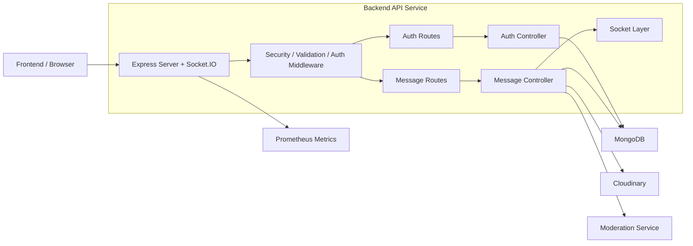
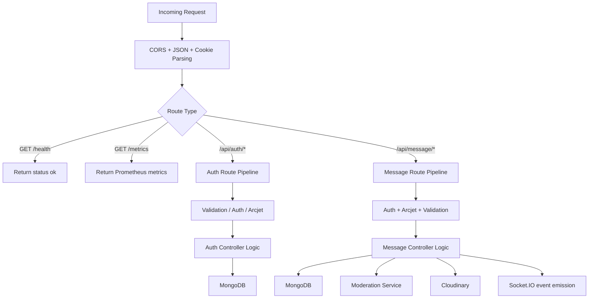
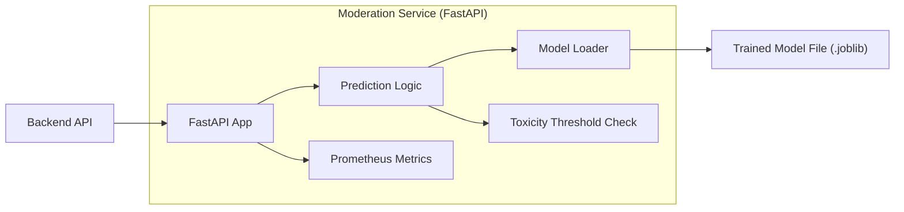
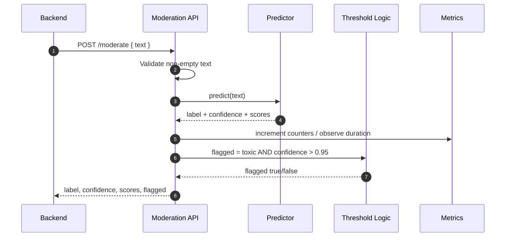
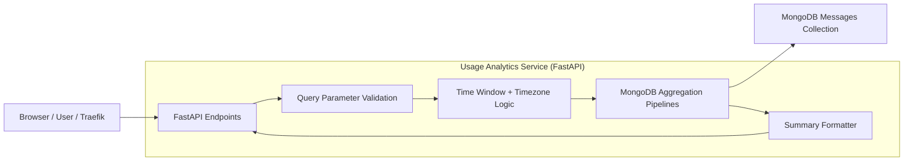
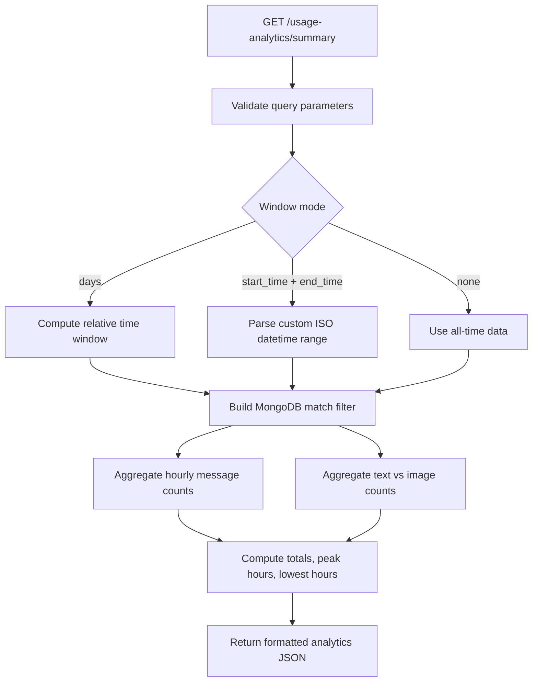
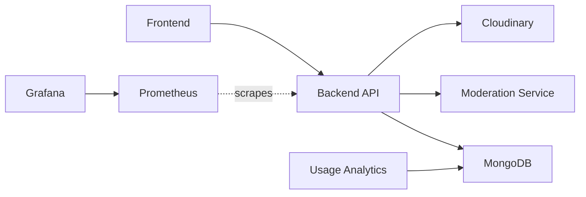

# Microservice Detail Diagrams

This document expands the high-level component view and explains each microservice in more detail.

## 1) Backend API Service

### Internal Component Diagram

### Request Processing Flow

## 2) Moderation Service

### Internal Component Diagram

### Moderation Request Flow

## 3) Usage Analytics Service

### Internal Component Diagram

### Analytics Processing Flow

## 4) Service-to-Service Communication Summary

