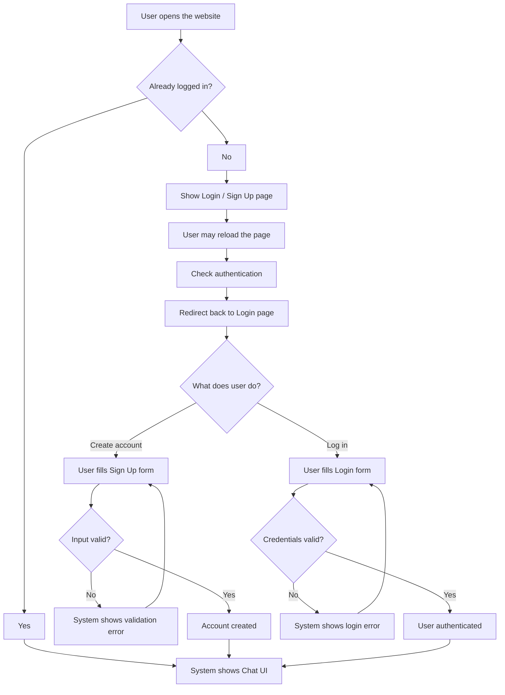
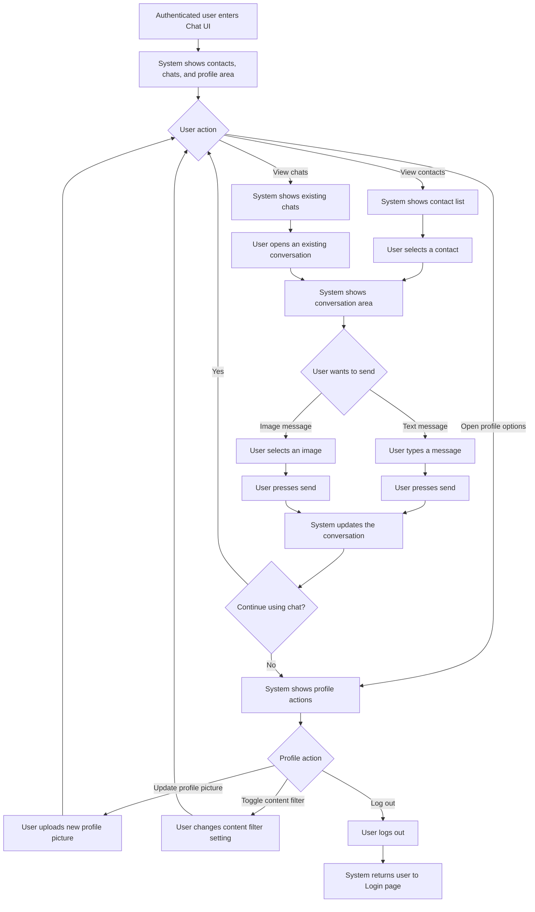
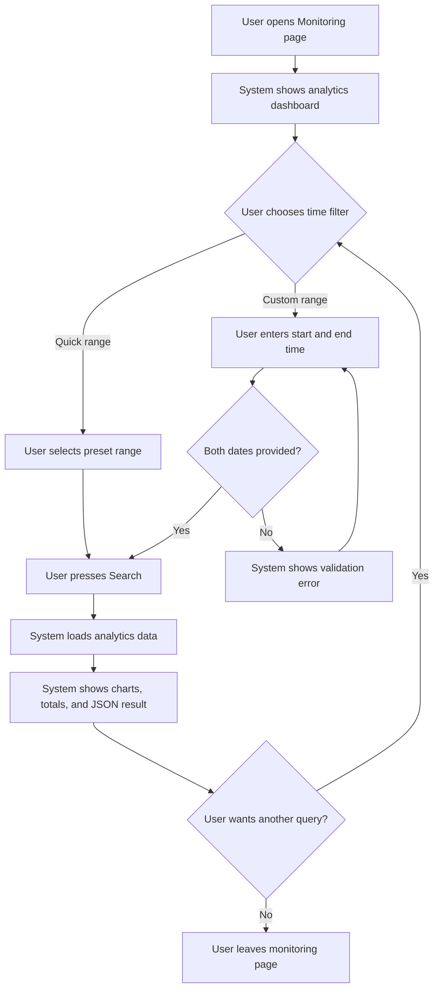

# User Case Flows

This document describes the system from the user's point of view.

Instead of technical internals, these diagrams focus on:

- what page or interface the user sees
- what the user does next
- how the system reacts

## 1) Unauthenticated User Flow

## 2) Authenticated Chat User Flow

## 3) Monitoring User Flow

## Notes

- These are user-centered interaction flows, not technical data flow diagrams.
- The first diagram focuses on a user who is not authenticated yet.
- The second diagram focuses on normal chat usage after login.
- The third diagram focuses on the monitoring page and analytics viewing flow.
