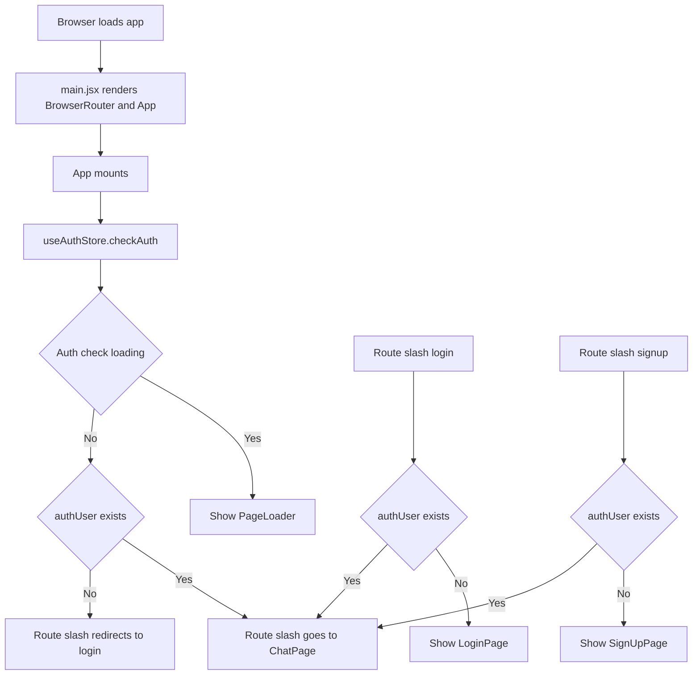
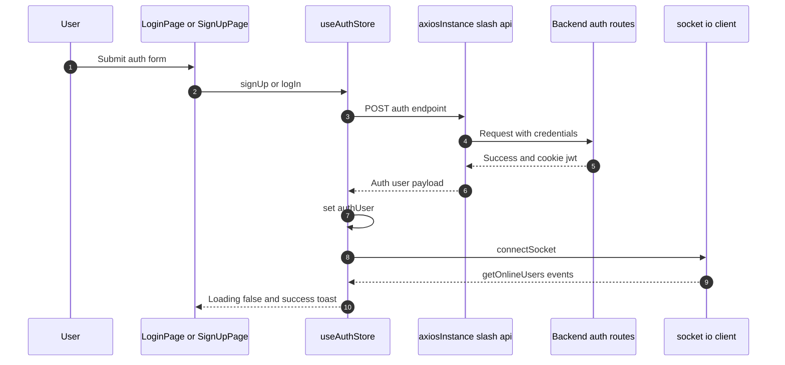
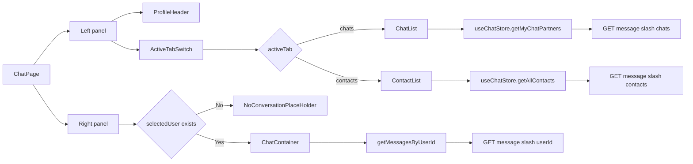
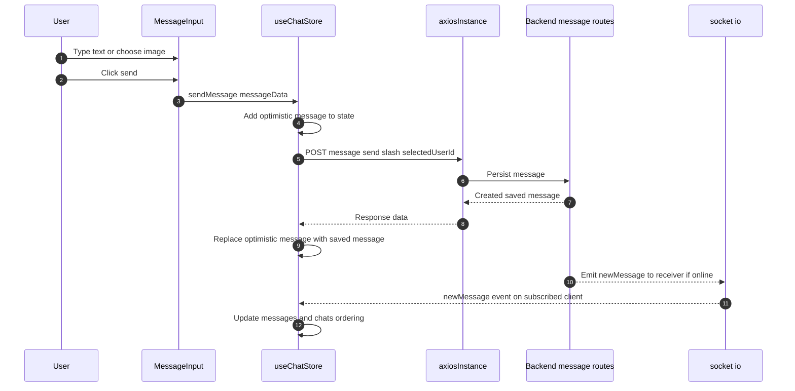
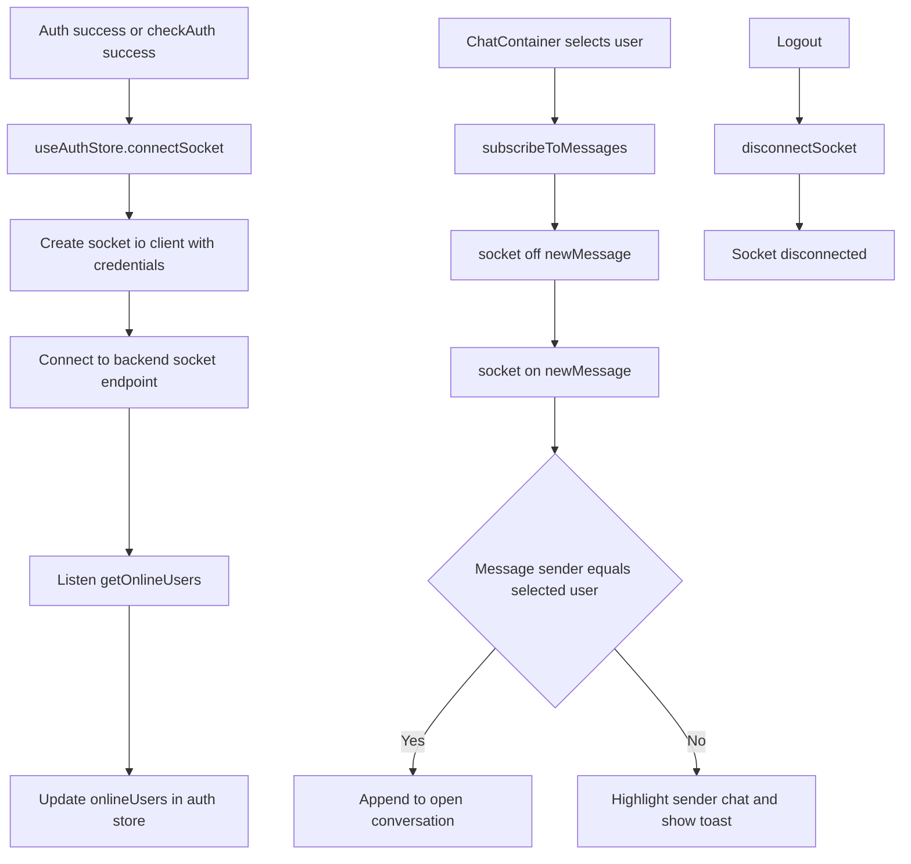
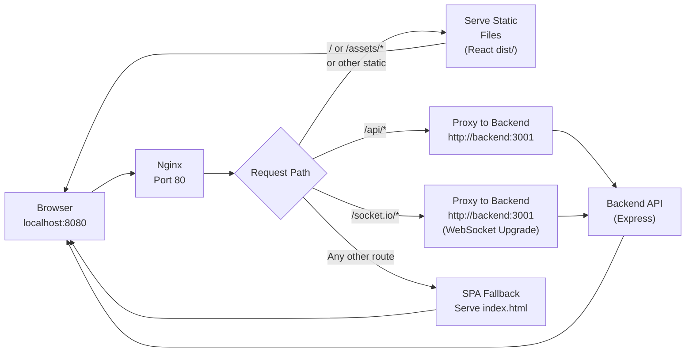
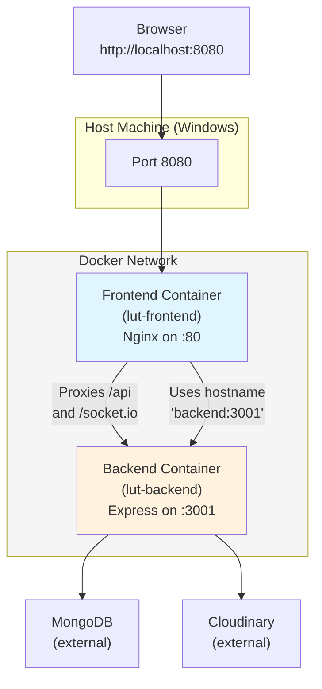

# Frontend Route And Feature Flow Diagrams

This document explains how the frontend works using diagrams for routing, authentication, chat state, API calls, and realtime messaging.

## 1) Frontend Boot And Route Guard Flow



## 2) Auth Actions To Backend

Routes used by frontend:
- `GET /api/auth/check`
- `POST /api/auth/signup`
- `POST /api/auth/login`
- `POST /api/auth/logout`
- `PUT /api/auth/update-profile`



## 3) Chat Page Composition And Data Loading



## 4) Send Message And Realtime Update



## 5) Socket Lifecycle In Frontend



## 6) Store Responsibility Map

- `useAuthStore`: auth user state, auth requests, socket connection, online users.
- `useChatStore`: contacts, chats, messages, selected user, send message, subscribe and unsubscribe to realtime events.
- `axiosInstance`: base URL and cookie credentials for all API requests.

## Notes

- Frontend routing is protected at component level in `App.jsx` using `Navigate`.
- JWT is stored in cookies by backend and sent automatically because axios uses `withCredentials: true`.
- Message sending uses optimistic UI for fast feedback, then reconciles with backend response.

---

## 7) Nginx Request Flow

Nginx runs inside the frontend container and routes incoming requests:



**Key Nginx Rules:**
- `client_max_body_size 10M` - Allows large image uploads in messages
- `try_files $uri $uri/ /index.html` - SPA routing fallback
- `proxy_read_timeout 600s` and `proxy_send_timeout 600s` - WebSocket stability
- `Upgrade` + `Connection "upgrade"` headers - WebSocket protocol support

---

## 8) Docker Compose Architecture

When you run `docker compose up --build`, both containers are created on a shared Docker network:



**Container Details:**
- **Frontend**: Node.js build stage → Nginx serving React dist in final stage. Exposes port 80 (mapped to host 8080).
- **Backend**: Node.js running Express. Exposes port 3001 (internal only, not directly accessible from host).
- **Network**: Both containers share `lut-cloud-course_default` network, so `backend` hostname resolves to the backend container's internal IP.

**Docker Compose Flow:**
1. `docker compose up --build` reads `docker-compose.yml`
2. Builds both Dockerfiles (frontend and backend) if images don't exist
3. Creates shared network and both containers
4. Starts backend first (dependency), then frontend
5. Routes requests: Browser → Port 8080 → Nginx → /api proxies to backend:3001 → Express

**Run Commands:**
```bash
# Start in background
docker compose up --build -d

# View logs
docker compose logs -f frontend
docker compose logs -f backend

# Stop all
docker compose down

# Stop and remove volumes (if DB volumes added)
docker compose down -v
```
