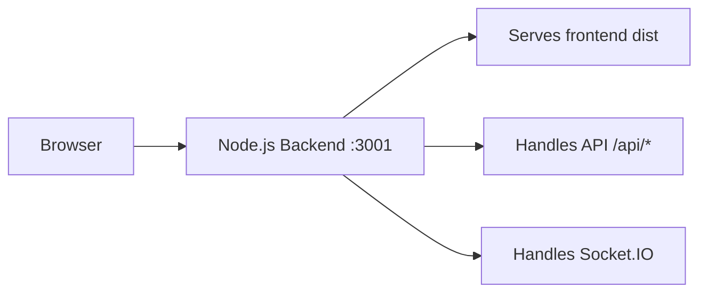
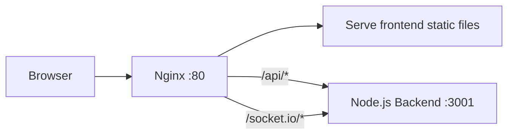

## Tasks:
1. ✅ Backend service: Implemented in Node.js/Bun.js/Deno with Express (or similar framework), handling API logic and authentication.
2. ⏳(**Need to change from axois to nginx**) Frontend UI: Built using React, served via Nginx.
3. ✅(**Better to stay with MongoDB**) Database: A relational database (MySQL/PostgreSQL) to store user data and system information.
4. ⏳(**Have to complete the whole task**) Processing microservice: A Python-based microservice performing some computational task (e.g., analytics, AI/ML, data processing, etc.).
5. ✅ Authentication system: JWT-based authentication for secure user access.
6. ⏳(**Have to complete the whole task**) Load balancing & reverse proxy: Using Traefik to distribute traVic across services.
7. ⏳(**Have to complete the whole task**) Monitoring & logging: Implemented via Grafana, Loki & Prometheus.
8. ⏳(**Quan: I have experience in this**) CI/CD pipeline: Automated deployment process using GitHub Actions.
9. ⏳(**Have to complete the whole task**) Deployment & orchestration: The system must be containerized and deployed using Docker Swarm & Portainer.
10. ⏳(**Have to complete the whole task - For security, we have Arcjet to protect use from DDOS and BOT**) HTTPS support & security

---
## Agenda:
### Sprint 1 (10/3 - 17/3. Next meeting: 17/3):
- Task 2: Quan + prepare the doc
- Task 6: Thet
- Task 7: Thet
- Task 10: Hung

### Srpint 2:
- Task 4

### Sprint 3:
- Task 8, 9

## Next deadline 🗓️:
**15/3**: Send the project description for acceptance.

---

# Cloud Course Project Ideas & Implementation Guide

## Python Microservice Options

### 1. Message Sentiment Analysis Service

**Purpose:** Analyze the emotional tone of messages in real-time or batch

**Features:**
- Use libraries like `transformers`, `textblob`, or `vaderSentiment`
- Process messages to detect sentiment (positive/negative/neutral) and emotion
- Return sentiment scores that could be stored in MongoDB

**Use Cases:**
- Display mood indicators in chat UI
- Generate emotional analytics for conversations
- Flag potentially toxic or aggressive messages

---

### 2. Chat Analytics & Insights Service

**Purpose:** Process chat history to generate meaningful statistics

**Features:**
- Analyze conversation patterns, response times, active hours
- Generate word clouds, trending topics, conversation summaries
- Create user engagement metrics

**Use Cases:**
- Dashboard showing chat activity trends
- Most active users/conversations
- Peak messaging times

---

### 3. Smart Content Moderation Service
> **Note:** This sounds nice - detect spam/hate speech

**Purpose:** AI-powered content filtering and safety

**Features:**
- Use ML models to detect spam, inappropriate content, or hate speech
- Classify messages by safety level
- Optionally blur/flag suspicious images (integrate with Cloudinary URLs)

**Use Cases:**
- Real-time message filtering before storage
- Protect users from harmful content
- Compliance with content policies

---

### 4. Message Summarization Service

**Purpose:** Generate TL;DR for long conversations

**Features:**
- Use NLP models (e.g., BART, T5) to summarize chat threads
- Create digest of unread messages

**Use Cases:**
- "Catch up" feature for users with many unread messages
- Conversation highlights

---

## Architecture Integration Options

- **REST API:** Python service with Flask/FastAPI that Node.js calls via HTTP
- **Message Queue:** Use RabbitMQ/Redis to queue messages for async processing
- **Shared Database:** Python service reads from same MongoDB instance
- **Docker Container:** Deploy as separate containerized service

---

## Load Balancing & Reverse Proxy with Traefik (need Docker)

### Why Traefik?
- Automatic service discovery with Docker
- Built-in Let's Encrypt SSL support
- Dynamic configuration without restarts
- Modern cloud-native design

### Step-by-Step Implementation (Simplest Approach)

#### Step 1: Create Traefik Configuration

Create `traefik.yml` in project root:
```yaml
api:
  dashboard: true
  insecure: true  # For local development

entryPoints:
  web:
    address: ":80"
  websecure:
    address: ":443"

providers:
  docker:
    endpoint: "unix:///var/run/docker.sock"
    exposedByDefault: false
    network: app-network

log:
  level: INFO
```

#### Step 2: Update docker-compose.yml

Add Traefik service and labels to existing services:

```yaml
version: '3.8'

services:
  traefik:
    image: traefik:v2.10
    container_name: traefik
    ports:
      - "80:80"
      - "443:443"
      - "8080:8080"  # Traefik dashboard
    volumes:
      - ./traefik.yml:/etc/traefik/traefik.yml:ro
      - /var/run/docker.sock:/var/run/docker.sock:ro
    networks:
      - app-network

  backend:
    build: ./backend
    labels:
      - "traefik.enable=true"
      - "traefik.http.routers.backend.rule=Host(`api.localhost`)"
      - "traefik.http.services.backend.loadbalancer.server.port=5000"
    networks:
      - app-network
    # Remove ports mapping - Traefik handles it

  frontend:
    build: ./frontend
    labels:
      - "traefik.enable=true"
      - "traefik.http.routers.frontend.rule=Host(`localhost`)"
      - "traefik.http.services.frontend.loadbalancer.server.port=80"
    networks:
      - app-network

  python-service:
    build: ./python-service
    labels:
      - "traefik.enable=true"
      - "traefik.http.routers.python.rule=Host(`python.localhost`)"
      - "traefik.http.services.python.loadbalancer.server.port=8000"
    networks:
      - app-network

networks:
  app-network:
    driver: bridge
```

#### Step 3: Access Services

- **Frontend:** http://localhost
- **Backend API:** http://api.localhost
- **Python Service:** http://python.localhost
- **Traefik Dashboard:** http://localhost:8080

#### Step 4: Enable Load Balancing (Optional)

To scale services and test load balancing:
```bash
docker-compose up -d --scale backend=3
```

Traefik will automatically distribute traffic across the 3 backend instances.

---

## Monitoring & Logging Setup

### Recommended Approach: Lightweight Stack (need Docker)

For minimal impact on the application, use this simplified stack:

#### Option 1: Prometheus + Grafana (Minimal Setup) ✅ Recommended

**Why this approach?**
- Prometheus is lightweight and efficient
- Grafana provides beautiful dashboards
- Skip Loki initially (can add later for logs)
- Use Docker's native logging for now

**Implementation Steps:**

1. **Add monitoring to docker-compose.yml:**

```yaml
services:
  prometheus:
    image: prom/prometheus:latest
    container_name: prometheus
    volumes:
      - ./monitoring/prometheus.yml:/etc/prometheus/prometheus.yml
      - prometheus-data:/prometheus
    ports:
      - "9090:9090"
    networks:
      - app-network

  grafana:
    image: grafana/grafana:latest
    container_name: grafana
    ports:
      - "3000:3000"
    environment:
      - GF_SECURITY_ADMIN_PASSWORD=admin
      - GF_USERS_ALLOW_SIGN_UP=false
    volumes:
      - grafana-data:/var/lib/grafana
    networks:
      - app-network

volumes:
  prometheus-data:
  grafana-data:
```

2. **Create `monitoring/prometheus.yml`:**

```yaml
global:
  scrape_interval: 15s

scrape_configs:
  - job_name: 'prometheus'
    static_configs:
      - targets: ['localhost:9090']

  - job_name: 'node-backend'
    static_configs:
      - targets: ['backend:5000']
    metrics_path: '/metrics'

  - job_name: 'python-service'
    static_configs:
      - targets: ['python-service:8000']
    metrics_path: '/metrics'

  - job_name: 'traefik'
    static_configs:
      - targets: ['traefik:8080']
```

3. **Add metrics endpoint to Node.js backend:**

Install package:
```bash
npm install prom-client
```

Add to `server.js`:
```javascript
const promClient = require('prom-client');
const register = new promClient.Registry();
promClient.collectDefaultMetrics({ register });

app.get('/metrics', async (req, res) => {
  res.set('Content-Type', register.contentType);
  res.end(await register.metrics());
});
```

4. **Add metrics to Python service:**

```python
from prometheus_client import make_asgi_app, Counter, Histogram
from fastapi import FastAPI

app = FastAPI()
metrics_app = make_asgi_app()
app.mount("/metrics", metrics_app)

# Custom metrics
request_count = Counter('requests_total', 'Total requests')
request_duration = Histogram('request_duration_seconds', 'Request duration')
```

5. **Access Dashboards:**
- Prometheus: http://localhost:9090
- Grafana: http://localhost:3000 (admin/admin)

6. **Import Pre-built Dashboards in Grafana:**
- Add Prometheus as data source
- Import dashboard ID `1860` (Node Exporter Full)
- Import dashboard ID `3662` (Prometheus 2.0 Overview)

#### Option 2: Simple Logging with Docker (No additional setup needed)

**For basic logging without Loki:**

```bash
# View logs for any service
docker-compose logs -f backend
docker-compose logs -f python-service

# View all logs
docker-compose logs -f

# Logs with timestamps and tail
docker-compose logs -f --timestamps --tail=100 backend
```

**Add structured logging in Node.js:**
```javascript
const winston = require('winston');

const logger = winston.createLogger({
  format: winston.format.json(),
  transports: [
    new winston.transports.Console()
  ]
});
```

---

## Summary: Implementation Priority

1. ✅ **Python Microservice:** Sentiment Analysis (Week 1)
2. ✅ **Traefik Setup:** Basic reverse proxy (Week 1-2)
3. ✅ **Prometheus + Grafana:** Minimal monitoring (Week 2)
4. 📋 **Optional:** Add Loki for centralized logging (Week 3+)

---

## Frontend Migration To Nginx (Step-by-Step)

This is not a replacement for axios. Axios stays in the frontend for API calls. Nginx will serve static frontend files and reverse proxy `/api` and `/socket.io` to backend.

### Architecture Diagrams

#### Current Architecture



#### With Nginx Architecture



### Step 1: Build Frontend Output

Run in frontend folder:

```bash
npm install
npm run build
```

Result: frontend static files are generated in `frontend/dist`.

### Step 2: Create Nginx Config

Create `frontend/nginx.conf`:

```nginx
server {
  listen 80;
  server_name _;

  root /usr/share/nginx/html;
  index index.html;

  # React SPA routing
  location / {
    try_files $uri $uri/ /index.html;
  }

  # Backend REST API proxy
  location /api/ {
    proxy_pass http://backend:3001;
    proxy_http_version 1.1;
    proxy_set_header Host $host;
    proxy_set_header X-Real-IP $remote_addr;
    proxy_set_header X-Forwarded-For $proxy_add_x_forwarded_for;
    proxy_set_header X-Forwarded-Proto $scheme;
  }

  # Socket.IO proxy
  location /socket.io/ {
    proxy_pass http://backend:3001;
    proxy_http_version 1.1;
    proxy_set_header Upgrade $http_upgrade;
    proxy_set_header Connection "upgrade";
    proxy_set_header Host $host;
  }
}
```

### Step 3: Create Frontend Dockerfile (Nginx)

Create `frontend/Dockerfile`:

```dockerfile
FROM node:20-alpine AS build
WORKDIR /app
COPY package*.json ./
RUN npm install
COPY . .
RUN npm run build

FROM nginx:1.27-alpine
COPY --from=build /app/dist /usr/share/nginx/html
COPY nginx.conf /etc/nginx/conf.d/default.conf
EXPOSE 80
```

### Step 4: Keep Axios Base URL As Relative Path

`frontend/src/lib/axios.js` should keep production base URL as `/api`.

Why: browser sends `/api/*` to Nginx, then Nginx forwards to backend.

### Step 5: Stop Serving Frontend In Backend (Production)

Remove backend static frontend serving block in production (the part that serves `frontend/dist`), because Nginx now handles frontend files.

### Step 6: Compose Services On Same Network

In `docker-compose.yml`:

- frontend service: built from `frontend/Dockerfile`, expose `80:80`
- backend service: expose internal `3001`
- both on same Docker network (example: `app-network`)

### Step 7: Verify End-to-End

1. Open frontend from Nginx URL
2. Login and verify cookie-based auth still works
3. Test API requests (`/api/auth/check`, `/api/message/*`)
4. Test realtime chat (Socket.IO)

### Minimal File Changes For This Migration

- New file: `frontend/nginx.conf`
- New file: `frontend/Dockerfile`
- Update file: `docker-compose.yml`
- Update file: backend server entry (remove frontend static serving in production)

Total: 4 files.

